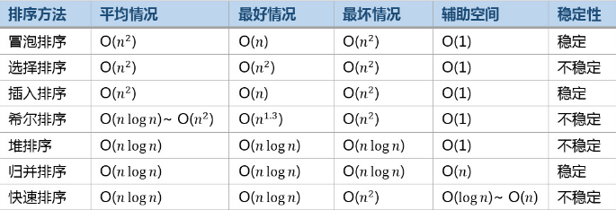

## 排序算法(Java版)



> 备注：以下动图来自于**一像素**的[排序算法](https://www.cnblogs.com/onepixel/p/7674659.html)

### 冒泡排序


```java
public static void bubbleSort(int[] arr) {
    if(arr.length == null || arr.length == 0) return new int[];
    
    int len = arr.length;
    for(int i = 0; i < len-1; i++) {
        for(int j = 0; j < len-i-1; j++) {
            if(arr[j]>arr[j+1]) swap(arr, j, j+1);
        }
    }
}
```

### 选择排序


```java
public static void selectSort(int[] arr) {
    if(arr.length == null || arr.length == 0) return new int[];
    int len = arr.length;
    for(int i = 0; i < len-1; i++) {
        minIndex = i;
        for(int j = i+1; j < len; j++) {
            if(arr[j]< arr[minIndex]) minIndex = j;
        }
        swap(arr, i, minIndex);
    }
}
```


### 插入排序


```java
public static void insertSort(int[] arr) {
    if(arr == null || arr.length == 0) return new int[];
    
    for(int i = 1; i < len; i++) {
        int current = arr[i];
        int preIndex = i-1;
        while(preIndex>=0 && arr[preIndex]>arr[i]) {
            arr[preIndex+1] = arr[preIndex];//后移
            preIndex--;
        }
        arr[preIndex+1]=current;
    }
}
```


### 希尔排序


```java
public class Shell {
    public static void shellSort(int[] a) {
        //升序排列
        int N = a.length;
        int h = 1;
        while(h < N/3) h = 3*h + 1;
        while(h>0) {
            for(int i = h; i < N; i++) {
                for(int j = i; j >=h && a[j]<a[j-h]; j -= h) {
                    swap(a, j, j-h);
                }
            }
            h = h/3;
        }
    }
}
```


### 归并排序


```java
public static void mergeSort(int[] arr, int left, int right) {
    sort(arr, left, right);
}

public static void sort(int[] arr, int left, int right) {
    if(left>=right) return;

    int mid = (left+right)/2;
    sort(arr, left, mid);
    sort(arr, mid+1, right);
    merge(arr, left, right);

}

public static void merge(int[] arr, int left, int right) {
    int[] result = new int[arr.length];
    int mid = (left+right)/2;
    int leftIndex = left, rightIndex = mid+1, i = left;
    System.out.println("left:"+left+", right: "+right);
    for(int j = 0; j <= right; j++) {
        System.out.printf("%d\t", arr[j]);
    }
    System.out.printf("\n");
    while(leftIndex <= mid && rightIndex <= right) {
        if(arr[leftIndex] < arr[rightIndex]) {
            result[i++] = arr[leftIndex++];
        } else {
            result[i++] = arr[rightIndex++];
        }
    }

    while(leftIndex <= mid) {
        result[i++] = arr[leftIndex++];
    }

    while(rightIndex <= right) {
        result[i++] = arr[rightIndex++];
    }
    //对arr进行重新复制
    for(int j = left; j <= right; j++) {
        arr[j] = result[j];
    }
    for(int j = 0; j <= right; j++) {
        System.out.printf("%d\t", arr[j]);
    }
    System.out.printf("\n");
}
```

```
left:0, right: 1
3       44
3       44
left:2, right: 3
3       44      38      5
3       44      5       38
left:0, right: 3
3       44      5       38
3       5       38      44
left:4, right: 5
3       5       38      44      47      36
3       5       38      44      36      47
left:4, right: 6
3       5       38      44      36      47      27
3       5       38      44      27      36      47
left:0, right: 6
3       5       38      44      27      36      47
3       5       27      36      38      44      47
left:7, right: 8
3       5       27      36      38      44      47      2       46
3       5       27      36      38      44      47      2       46
left:7, right: 9
3       5       27      36      38      44      47      2       46      4
3       5       27      36      38      44      47      2       4       46
left:10, right: 11
3       5       27      36      38      44      47      2       4       46      19      50
3       5       27      36      38      44      47      2       4       46      19      50
left:10, right: 12
3       5       27      36      38      44      47      2       4       46      19      50      48
3       5       27      36      38      44      47      2       4       46      19      48      50
left:7, right: 12
3       5       27      36      38      44      47      2       4       46      19      48      50
3       5       27      36      38      44      47      2       4       19      46      48      50
left:0, right: 12
3       5       27      36      38      44      47      2       4       19      46      48      50
2       3       4       5       19      27      36      38      44      46      47      48      50
```


### 快速排序


```java
public static void quickSort(int[] arr, int left, int right) {
        if(left>=right) return;
        int partIndex = partion(arr, left, right);
        quickSort(arr, left, partIndex-1);
        quickSort(arr, partIndex+1, right);
        for(int k = left; k < right+1; k++) {
            System.out.printf("%d\t", arr[k]);
        }
        System.out.printf("\n");
    }

    public static int partion(int[] arr, int left, int right) {
        // for(int k = left; k < right+1; k++) {
        //     System.out.printf("%d\t", arr[k]);
        // }
        // System.out.printf("\n");
        int pivot = arr[right];//每次以最后一个元素作为基准元素
        int i = left-1;//分割的下标
        for(int j = left; j < right; j++) {
            if(arr[j]<pivot) {
                swap(arr, ++i, j);
            }
        }
        swap(arr, ++i, right);
        // for(int k = left; k < right+1; k++) {
        //     System.out.printf("%d\t", arr[k]);
        // }
        // System.out.printf("\ni: "+i+"\n");
        return i;
    }
```

#### 算法改进

最优情况下，刚好对半分，复杂度为O(NlogN),最差情况下为O(n^2)。因此对于快速排序可以有以下改进方法：

- 数组个数较少时，切换为插入排序，所以可以设置当数组元素低于某个阈值时，设置为插入排序。

- **三数取中**，作为切分元素。就是把元素中最左最右和中间三个元素，取大小居中的元素作为切分元素，详情可见[这篇文章](https://www.cnblogs.com/chengxiao/p/6262208.html)。

- **三向切分**，对于有大量重复元素的数组，可以将其分为小于，等于和大于三部分。

  ```java
  //三向切分代码实现
  public void ThreeWayQuickSort(int[] arr, int l, int r) {
      if(l>=r) return;
      
      int lt = l, i = l+1, rt = r;
      int pivot = arr[l];
      while(i <= gt) {
          if(arr[i]<pivot) {
              swap(arr, i++, lt++);//把小于pivot的值放在最左边
          } else if(arr[i]>pivot) {
              swap(arr, i, gt--);//把大于pivot的值放在最右边
          } else {
              i++;//相等部分放在中间
          }
      }
      
      ThreeWayQuickSort(arr, l, lt-1);
      ThreeWayQuickSort(arr, gt+1, r);
  }
  ```

  **切分还可以用于选择算法，这样就实现二分查找的效果，比较总次数为N+N/2+N/4+...，最后必然小于2N次的比较结果**


### 堆排序

堆排序涉及到**堆**这个概念，堆的结点值总是大于等于其子节点，而且堆是一颗完全二叉树。因此堆可以用数组来表示，假设数组下标从1开始，那么位置为`k`的元素的父节点的位置为`k/2`，其子节点的位置分别为`2K`和`2k+1`。

```java
public class Heap<T extends Comparable<T>> {

    private T[] heap;
    private int N = 0;

    public Heap(int maxN) {
        this.heap = (T[]) new Comparable[maxN + 1];
    }

    public boolean isEmpty() {
        return N == 0;
    }

    public int size() {
        return N;
    }

    private boolean less(int i, int j) {
        return heap[i].compareTo(heap[j]) < 0;
    }

    private void swap(int i, int j) {
        T t = heap[i];
        heap[i] = heap[j];
        heap[j] = t;
    }
    
    public void swim(int k) {
        //上浮操作，不断跟父节点进行比较即可
        while(k>1 && less(k/2, k)) {
            swap(k, k/2);
            k = k/2;
        }
    }
	
    private void sink(int k) {
        //下沉操作，不断跟子节点比较
        while(2*k<=N) {//不超过元素的个数
            int j = 2*k;//左节点
            if(j < N&&less(j, j+1)) {//左节点小于右节点
            	j++;
            }
            if(less(j, k)) break;//大于子节点
            swap(k, j);
            k = j;
        }
    }
    
    private void insert(Comparable v) {
        head[++N]=v;//加入到数组尾，并增加数组个数N
        swim(N);//上浮到合适的位置
    }
    //删除最大元素
    private T deleteMax() {
        T max = T[1];
        swap(1, N--);//将尾子节点跟堆顶交换
        head[N+1]=null;
        sink(1);//将堆顶下沉
        return max;
    }
}
```


## 总结比较

|                  |        |                              |            |                          |
| ---------------- | ------ | ---------------------------- | ---------- | ------------------------ |
| 算法             | 稳定性 | 时间复杂度                   | 空间复杂度 | 备注                     |
| 选择排序         | ×      | N2                           | 1          |                          |
| 冒泡排序         | √      | N2                           | 1          |                          |
| 插入排序         | √      | N ~ N2                       | 1          | 时间复杂度和初始顺序有关 |
| 希尔排序         | ×      | N 的若干倍乘于递增序列的长度 | 1          |                          |
| 快速排序         | ×      | NlogN                        | logN       |                          |
| 三向切分快速排序 | ×      | N ~ NlogN                    | logN       | 适用于有大量重复主键     |
| 归并排序         | √      | NlogN                        | N          |                          |


