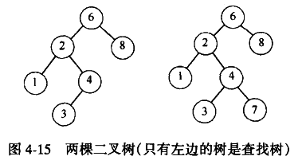

# 树

## 二叉查找树

将二叉树变成二叉查找树，对于树种每个节点X，它的左子树中所有相的值小于X中的值，右子树的所有项的值大于X中的值。



> 二叉查找树的平均深度为O(logN)，所以不必担心栈内存耗尽。

**BinaryNode**为BinarySearchTree的内部嵌套类。

```java
private static class BinaryNode<AnyType> {
    AnyType element;
    BinaryNode<AnyType> left;
    BinaryNode<AnyType> right;
    
    BinaryNode(AnyType theElement) {
        this(theElement, null null);
    }
    BinaryNode(AnyType theElement, BinaryNode<AnyType> lt, BinaryNode<AnyType> rt) {
        element = theElement;
        left = lt;
        right = rt;
    }
}
```

**BinarySearchTree**

```java
public class BinarySearchTree<AnyType extends Comparable<? super AnyType>> {
    //二叉查找树的每个节点定义
    private static class BinaryNode<AnyType> {}
    
    private BinaryNode<AnyType> root;
    
    public BinarySearchTree() {
        root = null;
    }
    
    public void makeEmpty() {
        root = null;
    }
    public boolean isEmpty() {
        return root == null;
    }
    
    public boolean contains(AnyType x) {
        return contains(x, root);
    }
    public AnyType findMin() {
        if(isEmpty()) throws new UnderflowException();
        return findMin(root).element;
    }
    public AnyType findMax() {
        if(isEmpty()) throws new UnderflowException();
        return findMax(root).element;
    }
    public void insert(AnyType x) {
        root = insert(x, root);
    }
    public void remove(AnyType x) {
        root = remove(x, root);
    }
    public void printTree(){}
    
    private boolean contains(AnyType x, BinaryNode<AnyType> t) {}
    
    private boolean contains(AnyType x, BinaryNode<AnyType> t) {
        //contains方法在二叉查找树中很简单，通过递归即可实现
        if(t == null) return false;
        int compareResult = x.compareTo(t.element);
        if(compareResult < 0) {
            //查找左子树
            return contains(x, t.left);
        } else if(compareResult > 0) {
            return contains(x, t.right);
        } else {
            return true;
        }
    }
    private BinaryNode<AnyType> findMin(BinaryNode<AnyType> t) {
        //findMin不断查找左子树最左的一个叶子节点，必然为最小
        if(t == null) {return null;}
        else if(t.left == null) {
            return t;
        }
        return findMin(t.left);
    }
    private BinaryNode<AnyType> findMax(BinaryNode<AnyType> t) {
        if(t != null) {
            while(t.right != null) {
                t = t.right;
            }
        }
        return t;
    }
    
    private BinaryNode<AnyType> insert(AnyType x, BinaryNode<AnyType> t) {
        if(t == null) {
            return new BinaryNode<AnyType>(x, null, null);
        }
        int compareResult = x.compareTo(t.element);
        
        if(compareResult < 0) {
            t.left = insert(x, t.left);
        } else if(compareResult > 0) {
            t.right = insert(x, t.right);
        }
        
        return t;
    }
    private BinaryNode<AnyType> remove(AnyType x, BinaryNode<AnyType> t) {
        if(t == null) return t;
        int compareResult = x.compareTo(t.element);
        
        if(compareResult < 0) {
            t.left = remove(x, t.left);
        } else if(compareResult > 0) {
            t.right = remove(x, t.right);
        } else if(t.left != null && t.right != null) {
            //第一种情况：左右子树均存在
            t.element = findMin(t.right).element;//将右子树最小的值取代当前节点
            t.right = remove(t.element, t.right);
        } else {
            //第二种情况：右子树不存在
            t = (t.left != null) ? t.left: t.right;
        }
        return t;
    }
    private void printTree(BinaryNode<AnyType> t) {}
}
```

