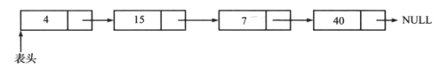
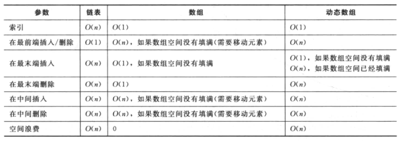
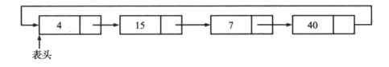

# 第三章：链表

## 概述

链表是一种存储数据集合的数据结构，相邻元素之间通过指针连接，链表长度不固定，空间是按需分配。



链表的主要操作是插入和删除操作，辅助操作有删除链表，计数，查找。


## 链表与数组

**数组**：

- 优点
  - 简单易用
  - 访问元素快（常数时间）
- 缺点
  - 大小固定
  - 需要分配一个连续空间块
  - 基于位置的插入操作的实现太过于复杂

**链表**：

- 优点
  - 容易扩展（常数时间）
  - 初始内存分配小
  - 删除开销低（单纯的删除单个元素操作，不包含检索元素的过程）
- 缺点
  - 访问元素开销大
  - 对元素的检索和操作开销相对较大



最后，链表常用在存储为主的操作中，数组则是在小容量的访问为主的操作中。


## 单向链表

```java
public class ListNode {
    private int data;
    private ListNode next;
    public ListNode(int data) {
        this.data = data;
        this.next = null;
    }
    //data,next的setter和getter方法
    //...
    
}
```

### 插入

1. 表头插入
   - 更新新节点的next值，指向当前的表头
   - 更新表头指针的值，指向新节点
2. 结尾插入
   - 更新新节点的next值为null
   - 更新尾节点的next值，指向新节点
3. 中间插入
   - 更新新节点的next值，指向插入位置的节点
   - 更新插入位置前一节点的next值，指向新节点

```java
ListNode InsertLinkedList(ListNode headNode, ListNode nodeToInsert, int position) {
    if(headNode == null) {
        return nodeToInsert;
    }
    int size = ListLength(headNode);
    if(position > size + 1 || position < 1) {
        System.out.println("position is invalid");
        return headNode;
    }
    if(position == 1) {
        //表头插入
        nodeToInsert.setNext(headNext);
        return nodeToInsert;
    } else {
        ListNode previousNode = headNode;
        int count = 1;
        while(count < position-1) {
            previousNode = previousNode.getNext();
            count++;
        }
        ListNode currentNode = previousNode.getNext();
        nodeToInsert.setNext(currentNode);
        previousNode.setNext(nodeToInsert);
    }
    return headNode;
}
```

### 删除

1. 表头删除
2. 表尾删除
3. 表中间节点删除

```java
ListNode DeleteNodeFormLinkedList(ListNode headNode, int position) {
    int size = getLinkedListLength(headNode);
    if(position > size || position < 1) {
        System.out.println("position is invalid");
        return headNode;
    }
    if(position == 1) {
        ListNode currentNode = headNode.getNext();
        headNode == null;
        return currentNode;
    } else {
        ListNode previousNode = headNode;
        int count = 1;
        while(count < position-1) {
            previousNode = previousNode.getNext();
            count++;
        }
        ListNode currentNode = previousNode.getNext();
        previousNode.setNext(currentNode.getNext());
        currentNode = null;//删除节点
    }
    return headNode;
}
```

删除整个单向链表，通过遍历每个节点，并将其置为null

```java
void DeleteLinkedList(ListNode head) {
    ListNode auxilaryNode, itertor = head;
    while(iterator != null) {
        auxilaryNode = iterator.getNext();
        iterator = null;
        iterator = auxilaryNode;
    }
}
```

## 双向链表

双向链表在单向链表的基础上增加一个前驱指针，因此双向可以通过两个方向进行操作。但是双向链表的缺点也是因为多增加一个指针造成，增加了空间开销，插入和删除操作比原来更繁琐。

```java
public class DLLNode {
    private int data;
    private DLLNode next;
    private DLLNode previous;
    
    public DLLNode(int data) {
        this.data = data;
     	this.next = null;//置为null避免内存内漏
        this.previous = null;
    }
    //getter和setter
}
```

双向链表插入和删除操作与单向链表类似，只是增加了前驱指针的操作。可以根据在当前链表的基础上修改。


## 循环链表

单向和双向链表通过将尾节点的指针置为null表示链表结束。但是循环列表并没有结束标志，首尾相连，常用在一些特殊情况下，例如多个进程需要在相同的时间内使用同一个资源，轮流使用该资源。



### 循环链表节点计数

```java
int CircularListLength(CLLNode headNode) {
    int length = 0;
    CLLNode currentNode = headNode;
    while(currentNode != null) {
        length++;
        currentNode = currentNode.getNext();
        if(currentNode == headNode) {
            break;
        }
    }
    return length;
}
```

### 插入

1. 表头插入
   - 更新新节点的next值，指向表头节点
   - 遍历循环列表直至表尾，表尾节点的next值指向新节点
   - 更新表头指针，将其指向新节点

```java
void InsertAtBeginInCLL(CLLNode headNode, CLLNode nodeToInsert) {
    nodeToInsert.setNext(nodeToInsert);
    if(headNode == null) {
        return nodeToInsert;
    }
    
    CLLNode currentNode = headNode;
    while(currentNode.getNext() != headNode) {
        // currentNode.setNext(currentNode.getNext());
        currentNode = currentNode.getNext();
    }
    nodeToInsert.setNext(headNode);
    currentNode.setNext(nodeToInsert);
    headNode = nodeToInsert;
    return headNode;
}
```

2. 表尾插入
   - 遍历到表尾，更新表尾节点指向新节点
   - 更新新节点的next值，指向表头

```java
void InsertAtEndInCLL(CLLNode headNode, CLLNode nodeToInsert) {
    CLLNode currentNode = headNode;
    while(currentNode.getNext()!=headNode) {
        currentNode = currentNode.getNext();
    }
    nodeToInsert.setNext(nodeToInsert);
    if(headNode == null) {
        headNode = nodeToInsert;
    } else {
        nodeToInsert.setNext(headNode);
        currentNode.setNext(nodeToInsert);
    }
} 
```

## 问题

1. 只遍历一次获取倒数第n节点？

   使用两个指针pNthNode和pTemp。pTemp和pNthNode同时指向表头，pNthNode先移动n次之后，pTemp再和pNthNode一起移动直至pNthNode移动到表尾，此时pTemp所指便是倒数第n个节点。

   ```java
   ListNode NthNodeFromEnd(ListNode head, int NthNode) {
       ListNode pTemp = head, pNthNode = null;
       for(int count = 1; count < NthNode; count++) {
           if(pTemp != null) {
               pTemp = pTemp.getNext();
           }
       }
       while(pTemp != null) {
           if(pNthNode == null) {
               pNthNode = head;
           } else {
               pNthNode = pNthNode.getNext();
           }
           pTemp = pTemp.getNext();
       }
       if(pNthNode != null){
           return pNthNode;
       }
       return null;
   }
   ```

2. 判断链表是否有环？

   经典方法：快慢指针，时间复杂度为O(n)

   > 补充：计算环的长度，也是快慢指针，找到环之后，快指针从相遇的地方开始移动（步长为1），直至第二次遇到慢指针，快指针的移动计数大小即为环的长度。

   ```java
   boolean DoesLinkedListContainsLoop(ListNode head) {
       if(head == null) {
           return false;
       }
       ListNode slowPtr = head, fastPtr = head;
       while(fastPtr.getNext() != null && fasPtr.getNext().getNext() != null) {
           slowPtr = slowPtr.getNext();
           fastPtr = fastPtr.getNext().getNext();
           if(slowPtr == fastPtr) {
               return true;
           }
       }
       return false;
   }
   ```

3. 寻找环的起始点？

   在2的基础上，快指针在相遇处移动，慢指针重新初始化在表头开始移动，步长均为1，相遇时就为环的起始点。其中的数学原理为此：*设链起点到环入口点间的距离为x，环入口点到问题1中fast与low重合点的距离为y，又设在fast与low重合时fast已绕环n周（n>0），且此时low移动总长度为s，则fast移动总长度为2s，环的长度为r。则        

    s + nr = 2s,n>0      ①         

    s = x + y               ②        由①式得  s = nr                         代入②式得        

    nr = x + y       

    x = nr - y                ③        

   现让一指针p1从链表起点处开始遍历，指针p2从encounter处开始遍历，且p1和p2移动步长均为1。则当p1移动x步即到达环的入口点，由③式可知，此时p2也已移动x步即nr - y步。由于p2是从encounter处开始移动，故p2移动nr步是移回到了encounter处，再退y步则是到了环的入口点。也即，当p1移动x步第一次到达环的入口点时，p2也恰好到达了该入口点。* （数学原理部分摘自[此篇](https://blog.csdn.net/wuzhekai1985/article/details/6725263)）

   ```java
   ListNode FindLoopLength(ListNode head) {
       if(head == null) {
           return false;
       }
       ListNode slowPtr = head, fastPtr = head;
       boolean loopExist = false;
       while(fastPtr.getNext() != null && fasPtr.getNext().getNext() != null) {
           slowPtr = slowPtr.getNext();
           fastPtr = fastPtr.getNext().getNext();
           if(slowPtr == fastPtr) {
               loopExist = true;
               break;
           }
       }
       if(loopExist) {
           slowPtr = head;
           while(slowPtr!=fastPtr) {
               fastPtr = fastPtr.getNext();
               slowPtr = slowPtr.getNext();
           }
           return slowPtr;
       }
       return null;
   }
   ```

4. 逆置单向链表

   ```java
   ListNode ReverseList(ListNode head) {
       ListNode temp = null, nextNode = null;
       while(head!=null) {
           nextNode = head.getNext();
           head.setNext(temp);
           temp = head;
           head = nextNode;
       }
       return temp;	
   }
   ```

5. 两个相交链表，寻找其相交点？

   提供一种时间复杂度为O(max(m, n))，m，n分别为两个链表的长度。

   - 获取两个链表的长度----O(max(m,n))
   - 计算两个长度差的d
   - 从较长的链表的表头开始移动，移动d步
   - 然后两个链表开始同时移动，直至出现两个后继指针相同的情况（O(min(m,n))）

   ```java
   ListNode FindIntersectingNode(ListNode list1, ListNode list2) {
       int L1=0, L2=0, diff=0;
       ListNode head1 = list1, head2 = list2;
       while（head1!=null) {
           L1++;
           head1 = head1.getNext();
       }
       while（head2!=null) {
           L2++;
           head2 = head2.getNext();
       }
       if(L1<L2) {
           head1 = list2;
           head2 = list1;
           diff = L2 - L1;
       } else {
           head1 = list1;
           head2 = list2;
           diff = L1 - L2;
       }
       for(int i = 0; i < diff; i++) {
           head1 = head1.getNext();
       }
       while(head1 != null && head2 != null) {
           if(head1 == head2) {
               return head1.getNext();
           }
           head1 = head1.getNext();
           head2 = head2.getNext();
       }
       return null;
   }
   ```

6. 逐队逆置链表？1->2->3->4->X变成2->1->4->3->X

   ```java
   ListNode ReversePairIterative(ListNode head) {
       ListNode temp1 = null;
       ListNode temp2 = null;
       while(head!=null && head.next != null) {
           if(temp1 != null) {
               temp1.next.next = head.next;
           }
           temp1 = head.next;
           head.next = head.next.next;
           temp1.next = head;
           if(temp2 == null) {
               temp2 = temp1;
           }
           head = head.next;
       }
       return temp2;
   }
   ```

   