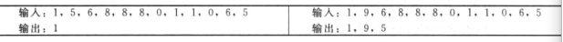

# 栈

栈是一种线性表结构，只允许在表的一段（栈顶，top）插入和删除元素，因此栈是一种后进先出（LIFO）的线性表。

- 专有名词概念：
  - 入栈（push）：在栈中插入一个元素
  - 出栈（pop）：在栈顶删除元素
  - 下溢（underflow）：在空栈中执行删除操作
  - 溢出（overflow）：试图对一个满栈执行入栈操作
- 应用：符号匹配，中缀表达式转换成后缀表达式，网页浏览器中以访问页面的历史记录等等
- 实现：简单数组的实现，动态数组的实现，基于链表的实现
- 关于递增策略和倍增策略的比较：
  - 递增：实现push操作的平摊时间开销为O(n)[O(n^2)/n]
  - 倍增：实现push操作的平摊时间开销为O(1)[O(n)/n]
- 数组和链表实现区别
  - 数组：倍增操作开销较大
  - 链表：每个操作都要使用额外的空间和时间开销来处理指针

## 问题

1. 判断一个含有特殊字符X的字符串是否为回文，使用栈？

   ```java
   boolean isPalindrome(String inputStr) {
       char inputChar[] = inputStr.toCharArray();
       Stack s = new LLStack();
       int i = 0;
       while(inputChar[i]!='X') {
           s.push(inputChar[i]);
           i++;
       }
       i++;
       while(i < inputChar.length) {
           if(s.isEmpty()) return false;
           if(inputChar[i]!=((Character)s.pop()).charValue()) return false;
       }
       return true;
   }
   ```

2. 只使用一个栈进行置换？

   时间复杂度O(n^2)，空间复杂度O(n)

   ```java
   //采用递归出栈
   public class StackReversal {
       public static void reverseStack(Stack stack) {
           if(stack.isEmpty()) return;
           int temp = stack.pop();
           reverseStack(stack);
           insertAtBottom(stack, temp);
       }
       
       private static void insertAtBottom(Stack stack, int data) {
           if(stack.isEmpty()) {
               stack.push(data);
               return;
           }
           int temp = stack.pop();
           insertAtBottom(stack, data);
           stack.push(temp);
       }
   }
   ```

3. 给定一个数字数组，删除所有相邻重复元素，如下图所示

   

   ```java
   public class RemoveAdjacentDuplicates {
       public int removeAdjacentDuplicates(int[] A) {
           int stkptr = -1;
           int i = 0;
           while(i < A.length) {
               if(sthptr == -1 || A[stkptr] != A[i])
           }
       }
   }
   ```

   

