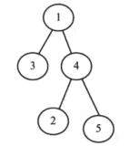

# 树

数是一种典型的非线性的数据存储结构，与链表类似，但却不同，因为树的一个节点可以指向多个节点。

- 部分术语
  - 叶子结点：没有孩子节点的节点叫做叶子节点
  - 节点的深度：从根节点到该节点的路径长度
  - 节点的高度：是指从该结点到最深结点的路径长度
  - 斜树：如果树中除了叶子节点外，其余每一节点只有一个孩子节点，这种树称作斜树。


## 二叉树

一棵树中每个节点只有0，1或2个孩子节点，那么这棵树称为**二叉树**。

- 类型

  - 严格二叉树：每个节点要么有两个孩子节点，要么没有孩子节点

        

  - 满二叉树：二叉树中每个结点恰好有两个孩子结点且所有叶子结点都在同一层

    

    

  - 完全二叉树：假定二叉树的高度为h，所有结点从根节点开始从左到右，从上之下，依次编号，那么将得到1到n的完整序列。所有叶子节点的深度为h或h-1，且在结点编号序列中没有漏电任何数字，这样的二叉树称为完全二叉树。

    

- 性质

  - 满二叉树的结点个数n为2^(h+1)-1
  - 完全二叉树的结点个数为2^h ~ 2^(h+1)-1
  - 满二叉树的叶子节点个数是2^h
  - 对于n个结点的完全二叉树，空指针的个数为n+1

- 结构

  定义两个指针，分别指向左右子树

  ```java
  public class BinaryTreeNode{
      private int data;
      private BinaryTreeNode left;
      private BinaryTreeNode right;
      //getter，setter方法
      //......
  }
  ```

- 应用

  - 编译器中表达式树
  - 用于数据压缩算法中赫夫曼编码树
  - 支持在集合中查找，插入和删除，其平均时间复杂度为O(logn)的二叉搜索树
  - 优先队列（PQ）支持以对数时间（最坏情况下）对集合中的最小（或最大）数据元素进行搜索和遍历

- 遍历

  - 前序遍历：先遍历当前结点，然后遍历左子树，最后遍历右子树
  - 中序遍历：首先遍历左子树，再访问当前结点，最后遍历右子树
  - 后续遍历：首先遍历左子树，再遍历右子树，最后访问当前结点
  - 层序遍历：按层遍历，这是一种广度优先遍历方法

### 遍历实现

#### 前序遍历

```java
//递归版本,时间复杂度为O(n),空间复杂度为O(n)
void PreOrder(BinaryTreeNode root) {
    if(root != null) {
        System.out.println(root.getData());
        PreOrder(root.getLeft());
        PreOrder(root.getRight());
    }
}
//非递归版本,时间复杂度为O(n),空间复杂度为O(n)
//采用一个栈进行记录
void PreOrderNonRecursive(BinaryTreeNode root) {
    if(root == null) return null;
    LLStack S = new LLStack();
    while(true) {
        while(root!=null) {
            System.out.println(root.getData);
            S.push(root);
            root = root.left;//遍历左子树
        }
        if(S.isEmpty()) break;
        root = (BinaryTreeNode)S.pop();
        root = root.getRight();
    }
    return;
}
```

#### 中序遍历

```java
//递归版本
void InOrder(BinaryTreeNode root) {
    if(root != null) {
        InOrder(root.getLeft());
        System.out.println(root.getData());
        InOrder(root.getRight());
    }
}
//非递归版本
void InOrderNonRecursive(BinaryTreeNode root) {
    if(root == null) return null;
    LLStack S = new LLStack();
    while(true) {
        while(root != null) {
            S.push(root);
            root = root.getLeft();
        }
        if(S.isEmpty()) break;
        root = (BinaryTreeNode)S.pop();
        System.out.println(root.getData());
        root = root.getRight();
    }
    return;
}
```

#### 后序遍历

```java
void PostOrder(BinaryTreeNode root) {
    if(root != null) {
        PostOrder(root.getLeft());
        PostOrder(root.getRight());
        System.out.println(root.getData());
    }
}

//非递归版本
//后序遍历的非递归版本：要解决当前结点要被访问两遍
void PostOrderNonRecursive(BinaryTreeNode root) {
    LLStack S = new LLStack();
    while(1) {
        if(root!=null) {
            S.push(root);
            root = root.getLeft();
        } else {
            if(S.isEmpty()) {
                System.out.println("Stack is Empty");
                return;
            } else {
                if(S.top().getRight() == null) {
                    //右子树不存在时
                    root = S.pop();
                    System.out.println(root.getData());
                    if(root == S.top().getRight()) {
                        System.out.println(S.top().getData());
                        s.pop();
                    }
                }
                if(!S.isEmpty()) root = S.top().getRight();
                else root = null;
            }
        }
    }
}
```

## 问题

对于树的问题，一般可以通过递归方法解决，采取非递归方法，可以采用队列存储元素。时间复杂度和空间复杂度均为O(n)。


1. 删除树？

   删除树一般采取后序遍历的方法，先删除孩子结点，再删除双亲结点。

   ```java
   void DeleteBinaryTree(BinaryTreeNode root) {
       if(root == null) return;
       DeleteBinaryTree(root.getLeft());
       DeleteBinaryTree(root.getRight());
       root = null;//置为null，GC会对其进行清理
   }
   ```

2. 逐层输出树中的元素，如下图所示，输出应为4 5 6 7 2 3 1

   

   解题思路：借助队列可以遍历每一层元素，通过栈可以输出每一层（从下往上）的元素

   ```java
   void LevelOrderTraversalInreverse(BinaryTreeNode root) {
       LLQueue Q = new LLQueue();
       LLStack S = new LLStack();
       BinaryTreeNode temp;
       if(root == null) return;
       Q.enQueue(root);
       while(!Q.isEmpty()) {
           temp = Q.deQueue();
           if(temp.getRight()) {
               Q.enQueue(temp.getRight());
           }
           if(temp.getLeft()) {
               Q.enQueue(temp.getLeft());
           }
           S.push(temp);
       }
       while(!S.isEmpty()) {
           System.out.println(S.pop().getData());
       }
   }
   ```

3. 将一颗树转换成其镜像？判断两棵树是否为镜像对称？

   ```java
   BinaryTreeNode MirrorOfBinaryTree(BinaryTreeNode root) {
       BinaryTreeNode temp;
       if(root) {
           MirrorOfBinaryTree(root.getLeft());
           MirrorOfBinaryTree(root.getLeft());
           //交换两个结点
           temp = root.getLeft();
           root.setLeft(root.getRight());
           root.setRight(temp);
       }
       //以上if条件里面还可以优化，再判断是否有左右子树，再执行迭代
   }
   
   //判断两棵树是否镜像
   int AreMirrors(BinaryTreeNode root1, BinaryTreeNode root2) {
       if(root1 == null && root2 == null) {
           return 1;
       }
       if(root1 == null || root2 == null) {
           return 0;
       }
       if(root1.getData()!=root2.getData()) {
           return 0;
       } else {
           return AreMirrors(root1.getLeft(), root2.getRight()) && AreMirrors(root1.getRight(), root2.getLeft());
       }
       
   }
   ```

4. 根据中序遍历和前序遍历结果构建一颗二叉树。

   前序遍历的顺序：根结点，左结点，右结点；中序遍历的顺序：左结点，根节点，右结点。

   ```java
   BinaryTreeNode BuildBinaryTree(int inOrder[], int preOrder[], int inStrt, int inEnd) {
       static int preIndex = 0;
       BInaryTreeNode newNode = new BinaryTreeNode();
       if(inStrt > inEnd) return null;
       if(newNode == null) {
           System.out.println("Memory Error");
           return null;
       }
       //利用preIndex在前序遍历中选择当前节点
       newNode.setData(preOrder[preIndex]);
       preIndex++;
       if(inStrt == inEnd)//该节点没有孩子结点返回
           return newNode;
       //否则在中序遍历中找到该节点的索引
       int inIndex = Search(inOrder, inStrt, inEnd, newNode.getData());
       //构建左右子树
       newNode.setLeft(BuildBinaryTree(inOrder, preOrder, inStrt, inIndex-1));
       newNode.setRight(BuildBinaryTree(inOrder, preOrder, inIndex+1, inEnd));
   }
   ```

5. 给定两个遍历序列能否构建一颗唯一的二叉树？

   - 中序和前序
   - 中序和后序
   - 中序和层次遍历

6. 寻找两个结点的最近公共祖先（LCA）。

   ```java
   BinaryTreeNode LCA(BinaryTreeNode root, BinaryTreeNode a, BinaryTreeNode b) {
       BinaryTreeNode left, right;
       if(root == null)
           return root;
       if(root == a || root == b) {
           return root;
       }
       left = LCA(root.getLeft(), a, b);
       right = LCA(root.getRight(), a, b);
       if(left && right) return root;
       else return left ? left: right;
   }
   ```


## 其他类型树

### 二叉搜索树

二叉搜索树有以下性质：

- 一个结点的左子树只能包含键值小于该节点键值的结点
- 一个结点的右子树只能包含键值大于该节点键值的结点
- 左子树和右子树都必须是二叉搜索树

```java
//二叉搜索树插入元素
BinarySearchTreeNode Insert(BinarySearchTreeNode root, int data) {
    if(root == null) {
        root = new BinarySearchTreeNode();
        if(root == null) {
            System.out.println("Memory error");
            return;
        } else {
            root.setData(data);
            root.setLeft(null);
            root.setRight(null);
        }
    } else {
        if(data < root.getData()) {
            root.setLeft(Insert(root.getLeft(), data));
        } else if(data > root.getData()) {
            root.setRight(Insert(root.getRight(), data))
        }
    }
}
```

