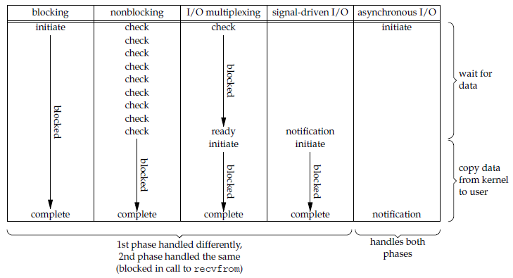
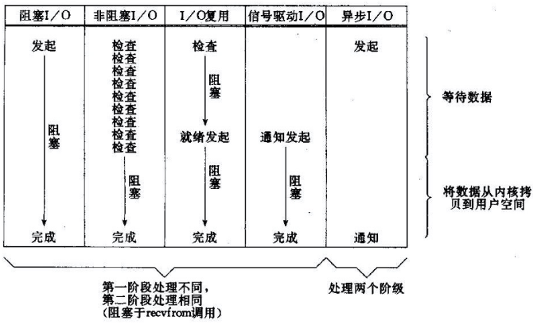

# I/O模型

Linux下五种I/O模型：

- 阻塞式I/O
- 非阻塞式I/O
- I/O复用（select和poll）
- 信号驱动式I/O（SIGIO）
- 异步I/O

### 阻塞式I/O

阻塞式I/O会导致应用进程阻塞，直至数据复制到应用进程缓冲区才返回去。在应用进程阻塞时，其他程序进程可以继续执行，不消耗CPU时间，所以该模型执行效率较高。


### 非阻塞式I/O

应用进程执行系统调用之后，内核会返回一个错误码。由于应用程序会继续执行下去，同时还会不断轮询查看I/O资源是否有空闲，从而可能会造成资源浪费。


### I/O复用

采用select和poll方式，在等待多个套接字中任意一个可读时，进程阻塞状态，可读后，返回该套接字，在对其进行读写操作。

I/O复用使得单个进程具有处理多个I/O时间的能力，又称Event Driven I/O。对比多进程和多线程技术，I/O复用没有进程或线程间切换的开销，系统开销更小。

#### select, poll, epoll

select和poll功能上基本一致：

- select修改描述符，poll不修改
- select描述符类型用数组实现，FD_SIZE默认为1024，因此最大监听1024个描述符；而poll采用链表实现，没有描述符数量限制
- poll提供更多的时间类型，对描述符的重复利用比select高
- 如果一个线程对描述符调用select或poll，另一个线程关闭该描述符，会导致调用结果不稳定
- select和poll的速度都很慢，因为每次调用都要把全部描述符从应用进程缓冲区复制到内核缓冲区中；每次返回结果并没有声明哪些描述符准备，而是判断返回值是否大于0，如果大于0，那么进程将通过轮询的方式找到准备好的描述符。
- 几乎所有系统都支持select，只有较新的系统支持poll

而关于epoll：

- 只支持Linux操作系统
- 没有描述符限制。因为通过epoll_ctl()向内核注册新的描述符或改变描述符状态，已注册的描述符在内核中会被维护在一颗红黑树上，通过回调函数内核将准备好的描述符加入到一个链表中进行管理
- epoll对多线程变成更友好，一个线程调用epoll_wait()，另一个线程关闭描述符的情况不会产生像select和poll那种不确定情况
- epoll具有两种工作模式：LT(level trigger，稍后处理)和ET(egde trigger，立即处理，但仅支持No-Blocking)

三种方式函数调用：

```c
//select
int select(int n, fd_set *readfds, fd_set *writefds, fd_set *exceptfds, struct timeval *timeout);

//poll
int poll(struct pollfd *fds, unsigned int nfds, int timeout);

//epoll
int epoll_create(int size);
int epoll_ctl(int epfd, int op, int fd, struct epoll_event *event)；
int epoll_wait(int epfd, struct epoll_event * events, int maxevents, int timeout);
```

三者应用场景：

1. select的timeout参数精度为1ns，而poll和epoll为1ms，因此select常用于实时性要求更高的地方，而且移植性高
2. poll用在监控描述符状态多，时间短暂的地方。
3. epoll只需要运行在 Linux 平台上，并且有非常大量的描述符需要同时轮询，而且这些连接最好是长连接

### 信号驱动I/O

应用进程使用sigaction系统调用，内核立即返回，应用程序继续执行。内核在数据到达时向应用进程发送SIGIO信号，应用进程接收到内核发送的信号时，使用系统调用读取数据。信号驱动I/O同样是非阻塞式，对比非阻塞式I/O的轮询方式，CPU利用率更高。


### 异步I/O

进程进行aio_read系统调用会立即返回，继续执行接下来的操作。内核会在所有I/O操作完成后给进程发送信号。对比信号驱动I/O，区别在内核发送信号的时机。



