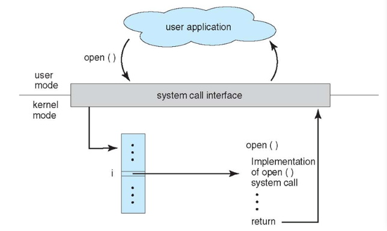
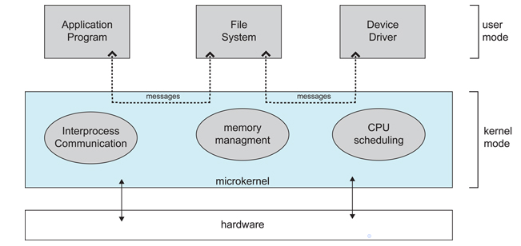
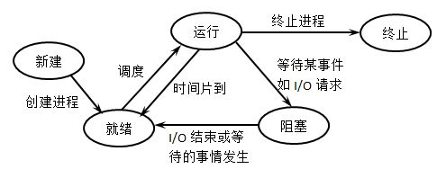
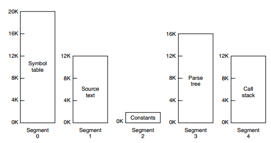

# 操作系统

## 进程管理

基本特征：

- 并发：是指在一段时间内能同时运行多个程序，对比并行则是指同一时刻能运行多个指令。并行需要硬件支持，如多流水线或多处理器。操作系统引入进程和线程概念，使得程序能够并发运行。
- 共享：互斥共享和同时共享。临界资源是互斥共享，同一时间只允许一个进程访问，需要有同步机制对临界资源进行访问。
- 虚拟：把一个物理实体转换为多个逻辑实体。主要分为两种虚拟技术：时分复用技术和空分复用技术。
- 异步：进程并非一次性执行完毕。

基本功能：

1. 进程管理功能：进程控制、进程同步、死锁处理等等
2. 内存管理功能：内存分配、地址映射、内存保护与共享、虚拟内存等等
3. 文件管理功能：存储管理，读写管理等等
4. 设备管理：I/O请求处理，缓冲管理、设备分配等等

**系统调用：**是指进程在用户态时调用内核的功能，从而进行系统调用进入内核态，由操作系统代为完成。

| Task     | Commands                    |
| -------- | --------------------------- |
| 进程控制 | fork(); exit(); wait();     |
| 进程通信 | pipe(); shmget(); mmap();   |
| 文件操作 | open(); read(); write();    |
| 设备操作 | ioctl(); read(); write();   |
| 信息维护 | getpid(); alarm(); sleep(); |
| 安全     | chmod(); umask(); chown();  |

(以上表格摘自CyC2018的[CS-Notes](https://github.com/CyC2018/CS-Notes/blob/master/notes/%E8%AE%A1%E7%AE%97%E6%9C%BA%E6%93%8D%E4%BD%9C%E7%B3%BB%E7%BB%9F.md)，侵权即删)

**大内核**：将操作系统功能聚合为一个整体，各模块共享信息，具有很高兴能。

**微内核**：随着操作系统越来越复杂，将大内核中的部分操作系统系统划分出来，变成一个个小模块，降低内核的复杂性。微内核运行在内核态，其他划分出来的模块运行在用户态，较原来切换状态可能会有一定性能损失。

中断类型：外部中断（I/O完成中断，控制台中断），异常，陷入（系统调用，进入内核态）

### 进程与线程

进程：资源分配的基本单位。

线程：独立调度的基本单位，同个进程内的多个线程共享进程资源，但是线程不拥有资源。

区别：

1. 进程拥有资源，线程没有；同一进程内线程切换不会引起进程切换。
2. 进程切换的系统开销比线程切换大很多，需要保存当前CPU环境和调用新进程CPU环境设置，内存分配等等；而线程切换则只需要保存和设置少量寄存器内存机壳。
3. 进程间通信需要同步和互斥手段，以确保数据一致性；而线程间则可以直接读写同一进程中数据段进行通信（数据段要做好同步）

进程的三种状态：

- 就绪状态：等待被调度
- 运行状态：占用CPU运行
- 阻塞状态：等待资源

### 进程调度算法

调度算法与操作系统类型有关，不同操作系统类型的调度算法目标不一样。

1. 对于批处理系统，调度算法的目标是保证吞吐量和周转时间。
   - 先来先服务（FCFS）
   - 短作业优先（Shortest job first）
   - 最短剩余时间优先（shortest remaining time next）

2. 对于交互系统，调度算法的目标则是要保证能够快速响应。
   - 时间片轮转：所有就绪进程按照FCFS原则进行排队，然后进程执行一个时间片，时间片结束，不管是否运行完毕，调度程度就会打断进行下一个进程。
   - 优先级调度：高优先级的进程首先执行。
   - 多级反馈队列：时间片+优先级调度的结合。
3. 实时系统，则要求一个请求必须在一个确定时间内得到相应，分成硬实时（绝对的截止时间）和软实时（可以容忍一定超时）。

### 进程同步方式

1. 信号量：是一个整型变量，可以对其执行P和V操作，也是down和up操作。这两种操作都是原语，不可分割

   	**down** : 如果信号量大于 0 ，执行 -1 操作；如果信号量等于 0，进程睡眠，等待信号量大于 0；

   	**up** ：对信号量执行 +1 操作，唤醒睡眠的进程让其完成 down 操作。

2. 管程：把信号量中控制部分代码独立出来，引入条件变量和wait,signal操作实现同步操作（对条件变量执行 wait() 操作会导致调用进程阻塞，把管程让出来给另一个进程持有；signal() 操作用于唤醒被阻塞的进程），在一个时刻只有一个进程使用管程，进程无法执行不能占用管程。[示例代码](https://github.com/CyC2018/CS-Notes/blob/master/notes/%E8%AE%A1%E7%AE%97%E6%9C%BA%E6%93%8D%E4%BD%9C%E7%B3%BB%E7%BB%9F.md#4-%E7%AE%A1%E7%A8%8B)

### 进程通信

- 管道：半双工通信和只能在父子进程中使用
- 命名管道（FIFO）：常用在C-S应用程序作为汇聚点，在客户进程和服务器进程间传输数据
- 消息队列：相比于 FIFO，消息队列具有以下优点：
  - 消息队列可以独立于读写进程存在，从而避免了 FIFO 中同步管道的打开和关闭时可能产生的困难；
  - 避免了 FIFO 的同步阻塞问题，不需要进程自己提供同步方法；
  - 读进程可以根据消息类型有选择地接收消息，而不像 FIFO 那样只能默认地接收。
- 信号量：为多个进程提供对共享数据对象的访问。
- 共享存储
- 套接字

### 死锁

产生的四个必要条件：

- 禁止抢占：系统资源不能被强制从一个进程中退出
- 持有和等待： 一个进程可以在等待时持有系统资源
- 互斥：只有一个进程能持有一个资源
- 循环等待：一系列进程互相持有其他进程所需要的资源

死锁预防：破坏四个条件其中一个即可。

死锁恢复：利用抢占恢复，回滚恢复以及杀死进程恢复

## 内存管理 

通过内存管理单元（MMU）管理地址空间和物理内存的转换

### 页面置换算法

1. 最佳页面置换算法：一种理论上算法，将最长时间内不再访问的页面换出，以保证最低的缺页率。
2. 最近最久未使用算法（LRU）：如果采用链表实现，链表表头为最近使用的，表尾为最近最久未被使用的页面，当链表满时，就将表尾删除。但是每次访问都会更新链表，因此链表实现的LRU代价很高。
3. 最近未使用（NRU）：通过设置R位和M位清除没有被访问，已被修改的类型的页面。有点容易实现，具体查看[这篇文件](http://book.51cto.com/art/200907/138182.htm)

  

虚拟内存采用**分页**技术，将地址空间划分为固定大小的页，每一页与内存进行映射。但是如果出现编译器建立多个表时，有4个表示动态增长，采用分页系统的一维地址空间，动态增长会导致覆盖问题的出现。因而出现**分段**，按照程序自动划分成不同的段（可动态改变），并且是二维地址空间。

**段页式**：程序的地址空间划分成多个拥有独立地址空间的段，每个段上的地址空间划分成大小相同的页，这样既拥有分段系统的共享和保护，也拥有分页系统的虚拟内存功能。

分页与分段的区别：

1. 分页对程序员透明，而分段需要程序员进行划分每个段
2. 分页是一维地址空间，分段是二维地址空间
3. 页的大小不变，段是动态改变
4. 分页只要实现虚拟内存，从而获得更大空间；分段则是为了程序和数据在逻辑上划分独立的地址空间有助于共享和保护

