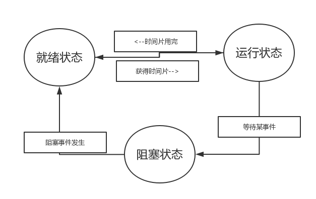

### 进程和线程

- 进程：计算机资源拥有的基本单位
- 线程：独立调度和独立运行的基本单元

### 进程的状态切换

进程的三种状态：就绪状态，运行状态，阻塞状态

### 进程间的通信方式

- 管道（pipe）：只允许具有“亲缘”关系之间进程交流，半双工通信
- 命名管道（named pipe）：允许不具有“亲缘”关系之间的进程交流，半双工
- 信号量（semophore）：计算器，用于控制资源的访问和作为进程间和同一进程内不同线程之间的同步
- 消息队列（message queue）：消息的链表
- 信号（signal）：主要用于通知进程某事件的发生
- 共享内存（shared memory）：最快的IPC方式
- socket套接字：用于不同终端间的不同进程相互通信

### 进程（作业）调度方式

- FCFS：按照先到先服务的原则，进行作业调度方式
- SJF：短作业优先方式，根据所需运行时间最短为优先的作业方式
- RR：时间片轮转调度算法，给每个进程分配一定的时间片进行作业调度
- HRRN：高响应比优先作业调度，由（等待时间+所需运行时间）/所需运行时间的比值，最大优先响应作业。
- 优先权调度：根据优先权进行调度
- 多级队列调度：根据作业的性质和类型的不同，分成不同就绪子队列，每个子队列采取不同的调度算法

### 产生死锁的原因

1. 不同进程相互竞争资源
2. 进程推进顺序不对造成进程阻塞

### 死锁产生的必要条件：

- 互斥条件：资源一次只能一个进程所占有
- 不剥夺（不可抢占）条件：资源仅能由所占有的进程释放
- 请求与保持条件：占有资源的进程又对别的资源发起请求，而别的资源已被其他进程所占
- 环路等待（循环等待）条件：当每类资源只有一个时，发生死锁，会存在一个进程资源的环形链

预防死锁，要防止以上其中一个条件（除了互斥）的发生即可。

死锁的充要条件：当且仅当死锁状态资源分配图不可完全简化。

#### 银行家算法

银行家算法的核心是说：保证自己的限额不低于一客户的限额，高于银行限额的客户将会被搁置或挂起，这样就能有效防止资源被占有不被释放。因此，银行家算法可以避免死锁发生。

#### 死锁解除

- 强制性从系统中撤销一个或多个死锁的进程以断开循环等待链
- 通过有效挂起和接触死锁的进程，来释放占有的进程

