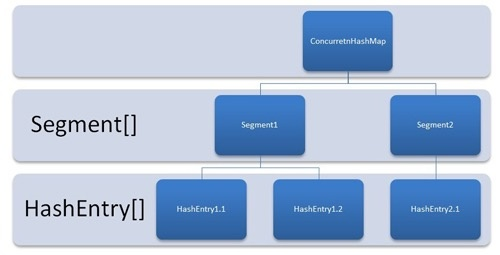
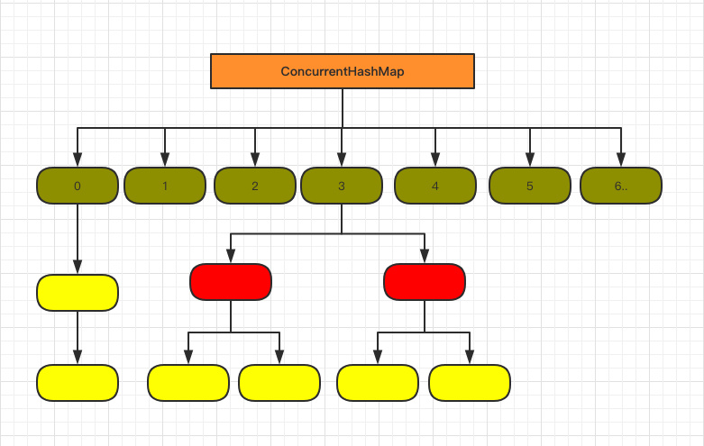

- ArrayList：内部采用数组实现，每次扩增在原来的基础上增加0.5倍，数组不被序列化，只序列化已有的值。

- LinkedList：内部采用双向链表实现（JDK7/8后，取消用循环链表），查询的时候，根据index位置来选择从头开始遍历还是从尾部开始遍历。

- HashMap：内部采用数据加链表（在JDK1.8中当hash碰撞之后写入链表长度超过阈值（默认为8），链表转换成红黑树，时间复杂度有O(n)变为O(logn)），总量和负载因子是HashMap的两个重要参数，*HashMap仅可以用在单线程中，并发环境容易造成死循环*。遍历有以下三种方式：

  - Map.Entry方式
  - Iterator方式
  - map.forEach((key, value)->{...}) **JDK1.8以上才可用**

- HashSet：内部采用HashMap<E, Object>实现，value均为同一个常量PRESENT，这样就保证Set的不可重复性。

- LinkedHashMap：记录顺序的HashMap，通过采用双向链表记录每个K-V的前后顺序。

- ConcurrentHashMap：是一个线程安全的并发容器。JDK1.7版本使用Segment和HashEntry实现，Segment继承ReentrantLock锁。JDK1.8则是采用CAS+synchronized来保证并发安全性，抛弃1.7的分段锁实现。1.7和1.8的ConcurrentHashMap展示：

  - 1.7版本

  

  - 1.8版本

  