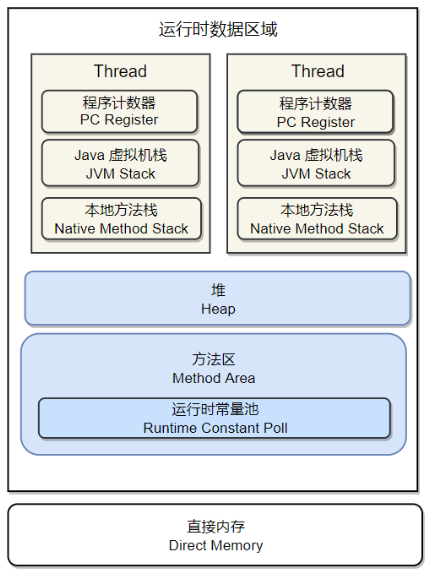

# JVM

## 运行时数据区域



- 程序计数器：记录正在执行的虚拟机字节码指令的地址，如果执行的是本地方法则为空。
- Java虚拟机栈：Java方法在执行的时候会创建一个栈帧存储局部变量表、操作数栈、常量池引用。方法的调用和完成对应着Java虚拟机栈中入栈和出栈操作。可以通过`-Xss`这个虚拟机参数设置线程中Java虚拟机栈内存大小。
- 本地方法栈：为本地方法服务，功能与Java虚拟机栈类似
- 堆：所有对象都在这里分配内存，是垃圾回收（GC）的主要区域。可以通过`-Xms`和`-Xmx`设置堆得初始值和最大值。现代垃圾收集器基本上采用分代收集算法，分成新生代和老年代。堆是动态扩展的。
- 方法区：用于存放已被记载的类信息、常亮、静态变量和即时编译器编译后的代码等数据。**JDK1.8把方法区移到元空间，位于本地内存之中，而非虚拟机内存中**。
  - 运行时常量池：Class文件中常量，String的intern()生成的常量都放在这里


## 垃圾回收

GC主要针对堆和方法区进行。程序计数器、虚拟机栈和本地方法栈这三个区域属于线程私有的，只存在于生命周期内。


**回收的方法**

- 引用计数法：该方法对于对象出现循环引用的话，引用计数永远不为0，无法回收，因此Java虚拟机不使用该技术算法。
- 可达性分析算法：从GC Roots开始搜索，所有可达的对象都是存活，不可达对象则被回收，Java虚拟机就用这个判断对象是否要被回收。GC Roots中包含的内容：
  - 虚拟机栈中局部变量表中引用的对象
  - 本地方法栈中JNI中的引用的对象
  - 方法区中类静态属性引用的对象
  - 方法区中的常量引用的对象
- 方法区的回收：方法区通常存放永久代对象，而永久代对象的回收率比新生代低很多，方法区主要是对常量池的回收和对类的卸载。类的卸载条件：（满足也不一定回收）
  - 该类所有的实例都已经被回收，也就是堆中不存在该类的任何实例。
  - 加载该类的 ClassLoader 已经被回收。
  - 该类对应的 Class 对象没有在任何地方被引用
- finalize()：该方法不常用，因为运行代价高，不确定性大，无法保证各个对象的调用顺序。而且在对象快被回收时，对象可以在finalize函数中实现自救。


### 引用类型

对象的回收的判断主要是根据对象的引用状态确定。Java中有四种引用类型：

- 强引用：被强引用关联的对象不会被回收。可以通过new一个新对象方式来创建强引用。

```java
Object obj = new Object();
```

- 软引用：软引用对象在内存不足的情况下会被回收。使用SoftReference创建软引用。

```java
Object obj = new Object();
SoftReference<Object> sf = new SoftReference<Object>(obj);
obj = null;//使对象被软引用关联
```

- 弱引用：弱引用对象一定会被回收，只能存活到下一次垃圾回收发生之前。

```java
Object obj = new Object();
WeakReference<Object> wf = new WeakReference<Object>(obj);
obj = null;
```

- 虚引用：虚引用对对象的生存时间不构成印象，也无法通过虚引用取得一个对象。设置虚引用的目的是在于对象被回收时能够收到一个系统通知。

```java
Object obj = new Object();
PhantomReference<Object> pf = new PhantomReference<Object>(obj);
obj = null;
```

### 收集算法

1. 标记-清除：将存活的对象进行标记，清理掉未被标记的对象。效率不高，而且会产生大量的内存碎片。
2. 标记-整理：将所有存活的对象移向一端，清除端边界以外的内存。解决第一种问题的内存碎片的问题，但是效率也是不高。
3. 复制算法：将内存划分成大小相等的两块，每次只使用其中一块，一块用完之后，把存活的对象复制到另外一块，然后清理。缺点也很明显，只使用一半的内存。
4. 分代收集：根据对象存活周期将内存划分为几块，不同块采用适当的收集算法。堆一般分为新生代和老年代：
   - 新生代：采用复制算法
   - 老年代：标记-清除或者标记-整理算法


## 内存分配与回收

GC产生有两种：Minor GC和Full GC两种

- Minor GC：发生在新生代上，速度快，执行频繁。
- Full GC：发生在老年代上，执行速度比Minor GC慢很多，因为老年代的对象存活时间长很多，因此Full GC发生次数少

### 分配策略

1. 对象有限在新生代Eden区中分配，当Eden空间不足时，将发起Minor GC，存活下来的对象会被移到Survivor区。
2. 需要连续内存空间的对象（如很长的字符串和数组）一般会直接进入老年代分配，通过设置`-XX:PretenureSizeThreshold`设定阈值，避免Eden区和Surivior区大量内存复制。
3. 进入Survivor区的对象，每经过一次Minor GC后，依旧存在的话，则年龄增长一岁，直到达到`-XX:MaxTenuringThreshold`设置的阈值，就会从Survivor区移到老年代中。
4. 动态对象年龄判断，根据Survivor区中某一年龄的对象达到Survivor区的一半以上是，虚拟机就会将大于这年龄的对象移到老年代，而无需达到`-XX:MaxTenuringThreshold`设置的阈值。
5. 发生Minor GC前，虚拟机需要先检查老年代最大可用的连续空间是否大于新生代的所有对象总空间，才可以执行Minor GC。否则虚拟机会根据HandlePromotionFailure的值来判断是否允许担保失败，如果是，重新检查，大于就执行Minor GC，小于或不允许失败就执行Full GC。

### Full GC触发条件

- 调用System.gc()不一定成功。
- 老年代空间不足
- 空间分配担保失败
- JDK1.7及之前永久代空间不足
- Concurrent Mode Failure触发Full GC