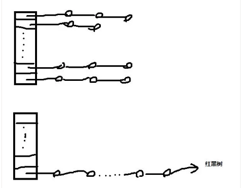

# Java基础知识记录
## 基础篇
1） 面向对象的特性有哪些？

封装，继承和多态

2）Java中覆盖和重载的意思和区别？

覆盖是指子类对父类**public,protected修饰的方法**的一种重写，只能比父类抛出更少的异常，访问权限也不能低于父类原有设定修饰符；

重载则是指同一个类中可以有多个相同名字的方法，根据参数类型不同、参数个数不同以及参数顺序不同进行区分，不能根据返回值类型进行重载。

3）抽象类和接口的区别？

- 1.抽象类中可以有具体方法实现，接口中的所有方法必须为抽象方法
- 2.抽象类中可以有普通的成员变量；接口中只有常量，即默认为static final类型，必须初始化
- 3.抽象类只能单继承（extends），接口可以继承多个父接口
- 4.Java8中提供default方法，允许接口实现具体方法
基类设计时，首先考虑实现一个接口，其次如果是需要成员变量和部分方法以实现的情况下，可以选择抽象类。

4）Java中值传递和引用传递？

Java中只有值传递，引用类型作为参数时，引用类型传递的副本里面存储的是对象的地址值。另外这里涉及到堆栈内存的概念，在Java中，在函数中定义的基本类型的变量和对象的引用变量都是放在函数的栈内存中分配；而由new创建的对象和数组则是放在堆内存中。
参考[这篇文章](https://my.oschina.net/u/2331760/blog/686365)

5）Java中常用的包？

java.lang java.util java.io java.net java.sql

6） JDK，JRE和JVM的区别与联系？
- JDK是java开发工具包，是Java开发环境的核心组建，提供编译，调试和运行程序的工具，可执行文件和二进制文件。
- JRE是Java运行时环境，是JVM的实施实现，提供Java程序的运行平台，包含了JVM但不包括Java编译器和调试器等工具。
- JVM是Java虚拟机，运行Java程序时，它将字节码转换成机器码。JVM提供了内存管理，垃圾回收和安全机制等。
区别：
1. JDK用于开发，JRE提供运行环境
2. JDK和JRE都包含JVM
3. JVM是Java编程语言的核心并且具有平台独立性

7）注解，反射，泛型

**待补充**

## Java中常见集合
1）Java中常见的集合有哪些？

Map和Collection接口是所有集合框架的父接口：
1. Collection接口的子接口包括：Set和List接口
2. Map接口的实现类主要有：HashMap、TreeMap、Hashtable、ConcurrentHashMap 以及 Properties 等
3. Set接口的实现类主要有：HashSet、TreeSet、LinkedHashSet等
4. List接口的实现类主要有：ArrayList、LinkedList、Stack和Vector等

2）HashMap和Hashtable的区别？
1. HashMap是线程不安全，没有考虑同步；Hashtable是线程安全的，采用synchronized关键字
2. HashMap允许null作为key，而Hashtable不允许null作为key

3）HashMap的底层实现？

（回去要补一下源码阅读）Java8以前采用数组+链表实现，Java8之后采用数组+链表+红黑树实现。

4）ConcurrentHashMap和Hashtable的区别？

ConcurrentHashMap是综合HashMap和Hashtable的特点。Hashtable每次同步都会锁住整个结构，这个操作很耗时，而ConcurrentHashMap则是提供更细微粒度的锁。ConcurrentHashMap 将 hash 表分为 16 个桶（默认值），诸如 get,put,remove 等常用操作，只锁当前的用到的桶。

ConcurrentHashMap的具体实现，里面有两个静态内部类HashEntry和Segment。HashEntry封装映射表的键值堆，而Segment是一种可重入的锁（ReentrantLock），每个Segment保护一个HashEntry，当需要修改HashEntry中数据时，需要先获取对应的Segment锁。

5）HashMap的长度为什么是2的幂次方？

1. 通过将Key的hash值与length-1进行&运算，得到Key的位置，2的幂次方可以减少冲突（碰撞）的次数，提高HashMap查询效率；
2. 如果length为2的次幂，那么length-1的二级制形式必然为1111....的形式，那么与hash值的&操作效率会非常的快，而且空间不浪费。
3. 如果length不是2的次幂，那么对应的二进制的最后一位总是为0，那么与hash进行与操作的时候，最后一位总是0，那么总有几个位置永远不能存放元素，空间浪费相当大。那这样进一步讲，碰撞效率增加，减慢了查询的效率，会造成空间的浪费。

6）List和Set的区别是啥？

List是有序的，可以重复的；Set是无序的，不可重复的

7）List、Set和Map的初始容量和加载因子

1. List：Array List的初始容量为10，加载因子为0.5，扩容增量：原容量*0.5+1，第一次扩容后长度为16；Vector初始容量为10，加载因子为1，扩容增量：原容量 * 1，第一次扩容后为20。
2. Set：HashSet初始容量为16，加载因子为0.75，扩容增量：原容量 * 1，第一次扩容为32 。
3. Map：HashMap的初始容量为16，加载因子为0.75，扩容增量：原容量 * 1，第一次扩容后为32 。

8）Comparable接口和Comparator接口有什么区别？

1. 前者简单，但在需要重新定义比较类型时，修改源代码，即嵌入到类；
2. 后者则不需要，可以通过自定义一个比较器，自定义一个比较方法，而不需要修改已有的类。

9）Java集合的快速失败机制“fail-fast”

这是Java集合的一种错误检测机制，当多个线程对集合进行结构上的改变的操作时，可能会产生fail-fast机制。因为当个线程对集合进行访问时，例如迭代器进行遍历时会访问集合中的数据，在遍历的过程中会使用modCount变量，当在遍历期间集合发生变化，那modCount就会改变，迭代器也会检测modCount是否为expectedmodCount值，是的话就继续遍历，否则抛出异常。

>  解决方案：1.在遍历过程中，所有涉及到改变modCount值全都加上synchronized；2.使用CopyOnWriteArrayList替换对应的ArrayList。

10）补充各个集合的底层实现！！！

## 高并发编程-JUC包

> JUC是指java.util.concurrent包，包含了线程池、异步IO和轻量级任务框架。

1）多线程和单线程的区别和联系？

1. 在单核CPU中，将CPU分为很小的时间片，在每一时刻只能有一个线程在执行，是一种微观上轮流占用CPU的机制。
2. 多线程会存在线程上下文切换，导致程序执行速度变慢。
3. 采用多线程可以减少用户的响应时间。

2）如何制定多个线程的执行顺序？

1. 设定一个orderNum，指定即将执行程序的线程，每个线程执行完，更新orderNum，并指明下一个执行的线程，唤醒所有等待线程。
2. 在每个线程执行之前，要先检测orderNum是否为自己的期待值，是则执行，否则继续等待。

3）线程和进程的区别

1. 进程是一个执行中的程序，是系统进行资源分配和调度的一个独立单位
2. 线程是进程的一个实体，一个进程中拥有多个线程，线程之间共享地址空间和数据资源
3. 线程上下文切换比进程上下文切换要快很多：
   1. 进程切换，需要保存当前进程的CPU环境和新调度的进程的CPU环境设置
   2. 线程切换，仅需要保存和设置少量的寄存器内容，不涉及存储管理

4）多线程产生死锁的4个必要条件？

- 互斥条件：一个资源每次只能被一个线程使用
- 请求和保持条件：一个线程因请求资源而阻塞时，对已获得资源保持不放
- 不剥夺条件：进程已获得的资源在未使用完之前，不能强行剥夺
- 循环等待条件：若干线程之间形成环状的循环等待资源关系

> 如何避免死锁：可以通过指定获取锁的顺序来避免死锁发生。

5）sleep和wait方法的区别：

1. sleep方法：是Thread类的静态方法，当前线程将睡眠n毫秒，线程进入阻塞状态。当睡眠结束时，会解除阻塞，进入可运行状态，等待CPU的到来。睡眠不释放锁。
2. wait方法：时Object的方法，调用时需结合synchronized一起使用，线程进入阻塞状态，当notify或notifyall被调用后，才会解除阻塞。睡眠时，会释放互斥锁，因此解除阻塞后，只有重新占用互斥锁才可以进入可运行状态。

6）synchronized关键字

1. 底层实现：进入时，执行monitorenter，将计数器+1，释放锁monitorexit时，计数器-1；当一个线程判断到计数器为0时，则当前锁空闲，可以占用，反之，当前线程进入等待状态。
2. 机制：synchronized是在加锁，加对象锁，对象锁是一种重量锁（monitor）。synchronized的锁机制会根据线程的竞争情况在运行时会有偏向锁（单一进程）、轻量锁（多个线程访问synchronized区域）、对象锁（重量锁，多个线程存在竞争的情况）、自旋锁等等。

7）volatile关键字

volatile关键字保证可见性，但不保证原子性。

功能：

1. 主内容和工作内存，直接与主内存产生交互，进行读写操作，保证可见性。
2. 禁止JVM进行的指令重排序。

8）ThreadLocal关键字

每个线程都有一个独立不共享的数据区，这就是ThreadLocal

- 内部实现机制：1. 每个线程内部都会维护一个类似HashMap的对象，称为ThreadLocalMap，里面包含若干的Entry（K-V键值对）；2.Entry的key为ThreadLocal实例，value为线程特有对象；3.Entry对key是弱引用，对value是强引用。

 

9）Atomic关键字

concurrent.atomic包下有各种基本数据类型对应的AtomicXXX（e.g AtomicInteger），可以使基本数据类型以原子方式实现自增自减等操作。

> 补充：为什么说i++不是线程安全？
>
> 因为i++包含三个步骤，
>
> 1. 拷贝i的值到临时变量
> 2. 临时变量++操作
> 3. 拷贝回原始变量i
>
> 所以i++的操作不能保证原子性，所以不是线程安全。

10）线程池

java.util.concurrent.ThreadPoolExecutor类就是一个线程池。客户端通过submit方法提交任务。线程池内部维护的工作者线程数量就是该线程池大小，3种线程池大小概念：

- 当前线程池大小：表示线程池中实际工作者线程的数量
- 最大线程池大小（maxinumPoolSize）：表示线程池中允许存在的工作者线程的数量上限
- 核心县城大小（corePoolSize）：表示一个不大于最大线程池大小的工作者线程数量上限

运行机制：

1. 如果运行线程少于corePoolSize，则Executor始终首选添加新的线程，而不进行排队
2. 如果运行的线程等于或者大于corePoolSize，则Executor始终首选将请求加入队列中，而不是添加新的线程
3. 如果无法请求加入队列，即队列已经满了，则创建新的线程，除非创建此次线程超过maxinumPoolSize，在这种情况下，任务将被拒绝

## JVM内存管理

1）JVM内存划分

1. 方法区（线程共享）：常量、静态变量、JIT（即时编译器）编译后的代码也都在方法区；
2. 堆方法（线程共享）：垃圾回收的主要场所
3. 程序计数器：当前线程执行的字节码的位置指示器
4. 虚拟机栈（栈内存）：保存局部变量、基本数据类型变量以及堆内存中某个对象的引用变量
5. 本地方法栈：为JVM提供使用native方法的服务

2）类似-Xms、-Xmn这些参数的含义

- 堆内存分配
  1. JVM初始分配内存由-Xms指定，默认是物理内存的1/64
  2. JVM最大分配的内存由-Xmx指定，默认是物理内存的1/4
  3. 默认空余堆内存小于40%时，JVM就会增大堆直到-Xmx的最大限制；若空余堆内存大于70%时，JVM会减少堆直到-Xms的最小限制
  4. 服务器一般设置-Xms、-Xmx相等以避免在每次GC后调整堆的大小。对象的堆内存由GC的自动内存管理系统回收
- 非堆内存分配
  1. JVM使用-XX:PermSize设置非堆内存初始值，默认是物理内存的1/64
  2. 由XX:MaxPermSize设置最大非堆内存的大小，默认是物理内存的1/4
  3. -Xmn2G：设置年轻代大小为2G
  4. -XX:SurvivorRatio：设置年轻代Eden和Survivor区的比值

3）垃圾回收算法

1. 引用计数：原理此对象有一个引用，即增加一个计数，删除一个引用则减少一个计数。垃圾回收时，只收集计数为0的对象。此算法最致命的是无法处理循环引用计数。
2. 标记-清除：此算法执行分两阶段。第一阶段从引用根节点开始标记所有被引用的对象，第二阶段遍历整个堆，把未标记的对象清除。缺点：使用时，整个应用被停止，同时会产生内存碎片。
3. 复制算法：此算法把内存空间划为两个相等区域，每次只使用其中一个区域。垃圾回收是，遍历当前使用区域，把正在使用的对象复制到另外一个区域。优点：每次只处理正在使用对象，复制成本低，另外将正在使用的对象复制到另外一个区域，相当于内存管理，不会出现碎片问题；缺点：需要两倍的空间。
4. 标记-整理：结合标记-清除和复制的优点，第一阶段标记从根节点开始标记所有被引用的对象，第二阶段清除所有未标记的对象，并将存活下来的对象压缩到堆的其中一块，按顺序排放。既避免了碎片问题，也避免了空间占用问题。

4）root所有算法中，哪些可以作为root？

- 被启动类（bootstrap加载器）加载的类和创建的对象
- JavaStack中引用的对象
- 方法区中静态引用指向的对象
- 方法区中常量引用指向的对象
- Native方法中JNI引用的对象

5）垃圾回收什么时候开始？

GC经常发生的区域是堆区，堆区还细分为新生代、老年代，新生代还细分为Eden区和两个Survivor区。

1. 对象有现在Eden中分配，当Eden中没有足够空间时，虚拟机将发生依次Minor GC，因为Java大多数对象都是朝生夕灭，所以Minor GC非常频繁，而且速度很快；
2. Full FC发生在老年代的GC，当老年代没有足够的空间时即发生Full GC，发生在Full GC时一般都会有一次Minor GC。大对象直接进入老年代，如很长的字符串数组，虚拟机提供一个XX:PretenureSizeThreadhold参数，令大于这个参数值的对象直接在老年代中分配，避免在Eden区和两个Survivor区发生大量的内存拷贝；
3. 发生Minor GC时，虚拟机会检测之前每次晋升到老年代的平均大小是否大于老年代的剩余空间大小，如果大于，则进行依次Full GC，如果小于则查看HandlePromotionFailure设置是否允许担保失败，如果允许，那只会进行依次Minor GC，如果不允许，则改为进行依次Full GC。

6）内存泄漏和内存溢出

- 概念：内存溢出是指内存不够用了；内存泄漏是指对象可达，但是没用，即本该被GC回收却没有被回收
- 关系：内存泄漏是内存溢出的原因之一。

内存泄漏的原因分析：

1. 长生命周期的对象引用短生命周期的对象；
2. 没有将无用对象置为null。