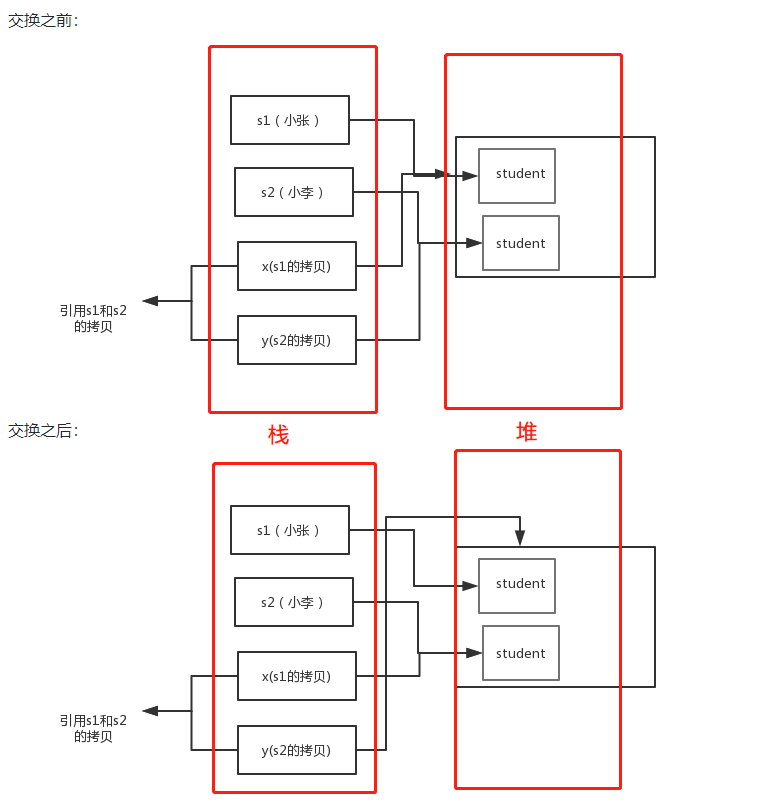
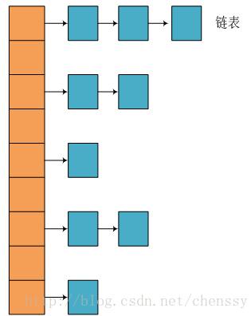
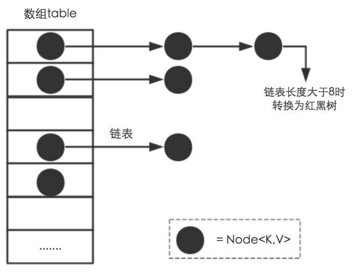

## 1. 为什么Java只有值传递？

Java没有指针这种说法，而且即使传递对象也并非所谓按引用传递，而是把栈中指向堆中某个地址值传递给参数，也依旧是值传递。对于基本数据类则和其他语言一样。

example：

```java
public class Test {

	public static void main(String[] args) {
		// TODO Auto-generated method stub
		Student s1 = new Student("小张");
		Student s2 = new Student("小李");
		Test.swap(s1, s2);
		System.out.println("s1:" + s1.getName());
		System.out.println("s2:" + s2.getName());
	}

	public static void swap(Student x, Student y) {
		Student temp = x;
		x = y;
		y = temp;
		System.out.println("x:" + x.getName());
		System.out.println("y:" + y.getName());
	}
}
/*输出结果
x:小李
y:小张
s1:小张
s2:小李
*/
```




## 2. ==和equals

==：对于基本数据类型，用来比较两个数值大小是否相等；对于对象，则是比较两个对象的地址值是否相等。

equals：是用来判断两个对象是否相等，一般有以下两种情况：

 	1. 类没有覆盖equals方法，则equal方法起的作用跟==相同。
 	2. 类覆盖equals方法时，则是比较两个对象的内容是否相同。


## 3. hashCode()和equals()方法

hashCode()方法的作用是用来获取哈希码，在哈希表中是为了确定对象的索引位置。HashSet中首先会通过hashCode方法判断集合中是否有相同的对象，如果哈希码不同则假设没有相同对象添加到集合；如果哈希码相同则再调用equals方法判断两个对象的内容是否相等，不同则重新散列到其他位置，相等则不添加。

**hashCode和equals方法相关规定**：

- 两个对象相同，则equals必然返回true，hashCode必然相等
- hashCode值相同，equals返回值不一定为true，即对象内容不一定相同
- equals被覆盖时，hashCode也需要被覆盖重写


## 4. String，StringBuilder和StringBuffer

String定义的对象是不可变，StringBuilder和StringBuffer是可变的。StringBuffer与StringBuilder不同之处在于它的方法都加了同步操作，所以是线程安全。这三种的使用情况：

1. 操作少量的数据，使用String
2. 单线程进行大量字符串操作时，可以使用StringBuilder
3. 多线程进行大量字符串操作是，可以使用StringBuffer

> 额外的，可以通过反射操作操作String对象可以使其改变。
>
> String s = "test1";
>
> System.out.println(s);
>
> Field valueOfString = String.class.getDeclaredField("value");
>
> valueOfString.setAccessible(true);//设置可访问权限
>
> char[] value = (char[])valueOfString.get(s);
>
> value[4] = '2';
>
> System.out.println(s);


## 5. 反射机制

Java中的反射机制是指：在运行状态中，对于任意一个类，可以知道这个类的所有属性和方法；对于任意对象，可以调用他的任意一个方法和属性。

**优点：**可以在运行期间，动态加载类，提高代码的灵活性

**缺点：**性能瓶颈，比直接写好的固定Java代码慢很多


反射机制通常是用来框架之中，例如Spring中的xml配置模式，就是很典型反射机制操作。


## 6. 字节码

Java中引入Java虚拟机的概念（JVM），即在机器和编译程序之间加入一层虚拟的机器，给编译程序提供统一接口，实现跨平台操作。编译程序生成虚拟机能够理解的代码，成为**字节码**，扩展名为`.class`的文件。字节码由虚拟机解释执行，虚拟机通过解释器将字节码翻译特定机器上的机器码。所以Java是编译和解释并存的语言。

> Java代码--》编译器--》jvm可执行的Java字节码--》JVM--》解释器--》机器可执行的二进制机器码--》程序运行

字节码的好处：

- 在一定程度上解决了传统解释型语言执行效率低下的问题，同时保留解释型语言可移植的特点。
- 字节码不针对特定机器，因此具有跨平台，由JVM解释翻译成对应的机器代码。


## 7. 接口和抽象类的区别

1. 接口中方法默认为public，且无法实现（但在JDK8中引入default关键字，接口可以实现某些方法）；抽象类可以有具体实现方法。
2. 接口定义的变量均为静态常量（static final修饰）。
3. 接口可以被多实现，但类只能是单继承。
4. 类实现接口必须实现所有方法，但继承抽象类却不必。


## 8.ArrayList和LinkedList异同

1. ArrayList和LinkedList都是不同步的，需要线程安全的，可以采用Java的并发集合包
2. 底层数据结构不同，ArrayList使用的是Object数组，而LinkedList采用的是双向链表结构
3. ArrayList的底层采用数组实现，所以插入和删除元素受元素位置的影响；而LinkedList底层采用链表实现，因此插入和删除操作不受元素位置的影响，时间复杂度近似为O(1)
4. ArrayList支持快速随机访问，即通过下标快速获取元素。
5. ArrayList主要空间浪费在于预留一定容量空间；而LinkedList的空间浪费则在于它每个结点的结构。


## 9.HashMap的底层实现

### JDK1.8以前

在JDK1.7及之前JDK版本中，HashMap的底层采用数组和链表的实现的**链表散列**。**HashMap 通过 key 的 hashCode 经过扰动函数处理过后得到 hash 值，然后通过 (n - 1) & hash 判断当前元素存放的位置（这里的 n 指的时数组的长度），如果当前位置存在元素的话，就判断该元素与要存入的元素的 hash 值以及 key 是否相同，如果相同的话，直接覆盖，不相同就通过拉链法解决冲突。**



**jdk1.7的hash方法**

```
static int hash(int h) {
    // This function ensures that hashCodes that differ only by
    // constant multiples at each bit position have a bounded
    // number of collisions (approximately 8 at default load factor).

    h ^= (h >>> 20) ^ (h >>> 12);
    return h ^ (h >>> 7) ^ (h >>> 4);
}
```

### JDK1.8

JDK1.8对hash方法进行简化，性能更好。此外还增加红黑树，即当链表的长度大于8（默认值），将会把链表转换成红黑树，保证了HashMap的检索速度。

```
static final int hash(Object key) {
      int h;
      // key.hashCode()：返回散列值也就是hashcode
      // ^ ：按位异或
      // >>>:无符号右移，忽略符号位，空位都以0补齐
      return (key == null) ? 0 : (h = key.hashCode()) ^ (h >>> 16);
  }
```



### 拓展

为什么HashMap的长度要为2的幂次方？

这样做是为了让HashMap获取高效，尽量较少碰撞，把数据分配均匀。另外，这里有个数学的技巧，**取余(%)操作中如果除数是2的幂次则等价于与其除数减一的与(&)操作（也就是说 hash%length==hash&(length-1)的前提是 length 是2的 n 次方；）。** 并且 **采用二进制位操作 &，相对于%能够提高运算效率，这就解释了 HashMap 的长度为什么是2的幂次方。**