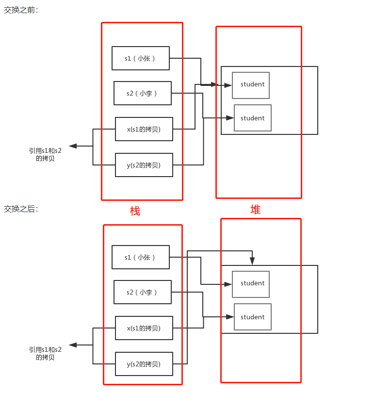

## 1. 为什么Java只有值传递？

Java没有指针这种说法，而且即使传递对象也并非所谓按引用传递，而是把栈中指向堆中某个地址值传递给参数，也依旧是值传递。对于基本数据类则和其他语言一样。

example：

```java
public class Test {

	public static void main(String[] args) {
		// TODO Auto-generated method stub
		Student s1 = new Student("小张");
		Student s2 = new Student("小李");
		Test.swap(s1, s2);
		System.out.println("s1:" + s1.getName());
		System.out.println("s2:" + s2.getName());
	}

	public static void swap(Student x, Student y) {
		Student temp = x;
		x = y;
		y = temp;
		System.out.println("x:" + x.getName());
		System.out.println("y:" + y.getName());
	}
}
/*输出结果
x:小李
y:小张
s1:小张
s2:小李
*/
```




## 2. ==和equals

==：对于基本数据类型，用来比较两个数值大小是否相等；对于对象，则是比较两个对象的地址值是否相等。

equals：是用来判断两个对象是否相等，一般有以下两种情况：

 	1. 类没有覆盖equals方法，则equal方法起的作用跟==相同。
 	2. 类覆盖equals方法时，则是比较两个对象的内容是否相同。