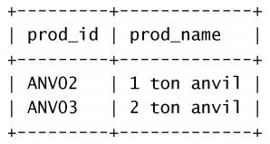
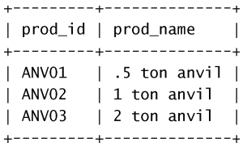

# MySQL入门笔记

---------------------------------------------------------------

**Date: 2018-02-26 **

**Author: Reborn**

**Update:2018-03-03**

---------------------------------

[TOC]

## 前言

*MySQL的基本增删改查操作。*

> MySQL的获取数据基本方式，以及简单筛选和过滤数据的操作。

> 更新：数据库表的创建，数据的插入更新和删除。

## 检索数据

### select检索数据

从prod_table选取prod_name这一列：

```mysql
SELECT prod_name FROM prod_table;
```

输出结果：

选取多列：

```mysql
SELECT prod_id, prod_name, prod_price FROM prod_table;
```

输出结果：

选取所有列：

```mysql
SELECT * FROM prod_table;
```

### DISTINCT关键字

DISTINCT关键字用来返回不同，不允许重复


选取出产品的厂商：

```mysql
SELECT DISTINCT vent_id FROM prod_table;
```


输出结果：

### LIMIT关键字
LIMIT关键字用来限制返回的条目数
```mysql
SELECT prod_name FROM prod_table LIMIT 5;
```
输出结果：

### ORDER BY子句
ORDER BY子句默认升序排列，加上DESE关键词变成绛序排列。
```mysql
SELECT prod_id, prod_price FROM prod_table ORDER BY prod_price;
SELECT prod_id, prod_price FROM prod_table ORDER BY prod_price DESC;
```
输出结果：, 

## 过滤数据

### WHERE筛选数据

where关键字，进行条件筛选，操作符有大于>，小于<，不等于<>(或者!=)等等，对于串类型，需要加上''来限定，数值类型则不需要

```mysql
SELECT prod_name, prod_price FROM prod_table WHERE prod_price = 2.5;
```

输出结果：

```mysql
SELECT prod_name, prod_price FROM prod_table WHERE prod_name = 'fuses';
```

输出结果：

> 数据库对大小写不敏感！

### 区间检测

#### BETWEEN操作符

使用BETWEEN和AND，可以让数据库返回一定区间范围值

```mysql
SELECT prod_name, prod_price FROM prod_table WHERE prod_price BETWEEN 5 AND 10;
```

输出结果：

#### IN操作符

in操作符获取满足区间内的值的所有行

```mysql
SELECT prod_name, prod_price FROM prod_table WHERE vend_id IN (1002, 1003, 1004);
```

取值写在括号，用‘,’分开，输出结果(获取生产产商为1002，1003，1004的所有商品)：

### 条件检测

#### AND操作符

与Python的and一样，必须多个条件同时成立才为true

```mysql
SELECT prod_id, prod_price, prod_name FROM prod_table WHERE vend_id=1003 AND prod_price <= 10;
```

输出结果：


#### OR操作符

与Python中or一样，满足多个条件其中之一即为true

```mysql
SELECT prod_name, prod_price FROM prod_table WHERE vend_id=1002 OR vend_id=1003;
```

输出结果：

> **AND操作符的优先级比OR操作符优先级高，必要的时候，使用括号()**

#### NOT操作符

取反操作，此外MySQL中not操作允许对in，between，exists子句进行取反。

```mysql
SELECT prod_name, prod_price FROM prod_table WHERE vend_id NOT IN(1002, 1003);
```

选取厂商id不为1002，1003的所有商品，输出结果：


### 空值检测

NULL值，即为**无值（no value）**，与字段为0，空字符串，和空格不一样。通过**IS NULL操作符**可判断是否为null值。

```mysql
SELECT cust_id FROM prod_table WHERE cust_email IS NULL;
```

输出email值为null的厂商：


### 通配符过滤

#### LIKE操作符，%通配符，_通配符

like操作符结合**通配符**可以实现简单模糊检索，通配符有%（适配多个或零个任意字符），_(适配单个字符)

```mysql
SELECT prod_id, prod_name FROM prod_table WHERE prod_name LIKE '_ ton anvil';
```

输出结果：

```mysql
SELECT prod_id, prod_name FROM prod_table WHERE prod_name LIKE '% ton anvil';
```

输出结果：

> 注意事项：
>
> 1. 通配符操作少用，因为通配符操作耗时相对较长
> 2. 通配符尽量不要开头，因为如果放在开头的话，搜索难度变大，搜索的时间就会变得更长


## 创建操纵表格

### CREATE创建表

create table语句创建表格，列与列之间用逗号分开，primary key指定表的主键，指定一列，表明该列的值唯一，指定多列，表明多列的组合必须唯一；auto_increment自增，每个表中只允许一列为AUTO INCREMENT，而且必须成为索引；NOT NULL表示该列必须有值，否则在插入和更新行，将会出错。创建一个customers表

```mysql
CREATE TABLE customers (
	cust_id      int      NOT NULL AUTO_INCREMENT,
  	cust_name    char(50) NOT NULL,
  	cust_address char(50) NULL,
  	cust_city    char(50) NULL,
  	cust_state   char(5)  NULL,
  	cust_zip     char(10) NULL,
  	cust_country char(50) NULL,
  	cust_contact char(50) NULL,
  	cust_email   char(50) NULL,
  	PRIMARY KEY (cust_id)
)ENGINE=InnoDB;
```

#### DEFAULT默认值

default关键字可以给NOT NULL列设置默认值

```mysql
CREATE TABLE customers (
	cust_id      int      NOT NULL AUTO_INCREMENT,
  	cust_name    char(50) NOT NULL,
  	cust_address char(50) NULL,
  	cust_city    char(50) NULL,
  	cust_state   char(5)  NULL DEFAULT ‘CN’,
  	cust_zip     char(10) NULL,
  	cust_country char(50) NULL,
  	cust_contact char(50) NULL,
  	cust_email   char(50) NULL,
  	PRIMARY KEY (cust_id)
)ENGINE=InnoDB;
```

#### 引擎

- InnoDB是一个可靠的事务处理引擎，不支持全文本搜索
- MEMORY功能等同MyISAM，数据存储在内存中，速度快，适合临时表
- MyISAM性能极高，支持全文本搜索，但不支持事务处理

### ALTER更新表

ALTER TABLE用于更新表，常用于增加新的列和定义外键。

```mysql
ALTER TABLE vendors ADD vend_phone CHAR(20);#增加新的列
ALTER TABLE vendor DROP COLUMN vend_phone;#删除新增的列
ALTER TABLE orderitems ADD CONSTRAINT fk_orderitems_orders FOREIGN KEY (order_num) REFERENCES orders (order_num);#定义外键
```

### DROP删除表

DROP TABLE删除表

```mysql
DROP TABLE customers；
```

### RENAME关键字

rename table给表进行重命名，可以同时给多个表进行重命名

```mysql
RENAME TABLE backup_customers TO customers,
			 backup_vendors TO vendors，
			 backup_products TO products;
```

## 插入和更新数据

### INSERT插入数据

insert语句用于给数据库插入新的数据，可以插入一行，也可以插入多行，编写时，最好要指定需要插入值的列及其次序。此外表中的列允许NULL值时，可以忽略插入；另外由于SQL中频繁的操作的SELECT语句，而且INSERT语句可能会很耗时，当检索比较重要时，可以给INSERT语句加上LOW PRIORITY关键词。

```mysql
#编写安全的MySQL语句
INSERT INTO customers(cust_name,
                     cust_contact,
                     cust_email,
                     cust_address,
                     cust_city)
              VALUES('Pep E.LaPew',
                    NULL,
                    NULL,
                    '100 Main Street',
                    'Los Angeles');
                    
#插入多行
INSERT INTO customers(cust_name,
                     cust_contact,
                     cust_email,
                     cust_address,
                     cust_city)
              VALUES('Pep E.LaPew',
                    NULL,
                    NULL,
                    '100 Main Street',
                    'Los Angeles')，
               VALUES('M. Martian',
                     NULL,
                     'test@email.com',
                     '42 Galaxy Way',
                     'New York');
```

### 插入检索出的数据

INSERT SELECT语句，SELECT和INSERT的所用列名不一定一致，MySQL主要根据位置进行填充

```mysql
INSERT INTO customers(cust_id,
                     cust_contact,
                     cust_email,
                     cust_name,
                     cust_city)
             SELECT cust_id,
             		cust_contact,
             		cust_email,
             		cust_name,
             		cust_city
             	FROM custold;
```

从custold表中检索出数据，插入到customers表中。


## 更新和删除数据

### UPDATE更新数据

update语句可以更新特定行也可以更新所有行，通过SET命令更新列的值，使用update务必小心，避免更新所有行，因此最好设置好WHERE语句。

```mysql
UPDATE customers SET cust_email = 'elmer@fudd.com', cust_state='CN' WHERE cust_id=10005;
```

### DELETE删除数据

delete语句删除某行或所有行的数据，通过设置WHERE语句进行限定，比较安全。

```mysql
DELETE FROM customers WHERE cust_id = 10005;
```

> DELETE删除整行的数据，若要删除某一列的数据，需要使用UPDATE语句，将某一列的设置为NULL即可