# MySQL入门笔记

---------------------------------------------------------------

**Date: 2018-02-26 **

**Author: Reborn**

---------------------------------

[TOC]

## 前言

MySQL的获取数据基本方式，以及简单筛选和过滤数据的操作。

## 检索数据

### select语句

从prod_table选取prod_name这一列：

```mysql
SELECT prod_name FROM prod_table;
```

输出结果：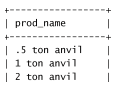

选取多列：

```mysql
SELECT prod_id, prod_name, prod_price FROM prod_table;
```

输出结果：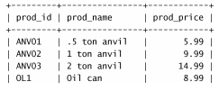

选取所有列：

```mysql
SELECT * FROM prod_table;
```

### DISTINCT关键字

DISTINCT关键字用来返回不同，不允许重复


选取出产品的厂商：

```mysql
SELECT DISTINCT vent_id FROM prod_table;
```


输出结果：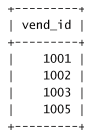

### LIMIT关键字
LIMIT关键字用来限制返回的条目数
```mysql
SELECT prod_name FROM prod_table LIMIT 5;
```
输出结果：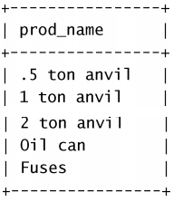

### ORDER BY子句
ORDER BY子句默认升序排列，加上DESE关键词变成绛序排列。
```mysql
SELECT prod_id, prod_price FROM prod_table ORDER BY prod_price;
SELECT prod_id, prod_price FROM prod_table ORDER BY prod_price DESC;
```
输出结果：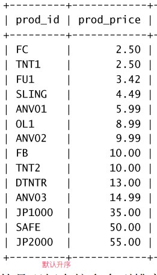, 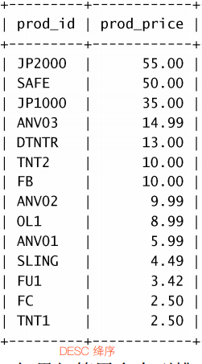

## 过滤数据

### WHERE关键字

where关键字，进行条件筛选，操作符有大于>，小于<，不等于<>(或者!=)等等，对于串类型，需要加上''来限定，数值类型则不需要

```mysql
SELECT prod_name, prod_price FROM prod_table WHERE prod_price = 2.5;
```

输出结果：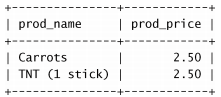

```mysql
SELECT prod_name, prod_price FROM prod_table WHERE prod_name = 'fuses';
```

输出结果：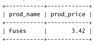

> 数据库对大小写不敏感！

### 区间检测

#### BETWEEN操作符

使用BETWEEN和AND，可以让数据库返回一定区间范围值

```mysql
SELECT prod_name, prod_price FROM prod_table WHERE prod_price BETWEEN 5 AND 10;
```

输出结果：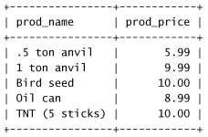

#### IN操作符

in操作符获取满足区间内的值的所有行

```mysql
SELECT prod_name, prod_price FROM prod_table WHERE vend_id IN (1002, 1003, 1004);
```

取值写在括号，用‘,’分开，输出结果(获取生产产商为1002，1003，1004的所有商品)：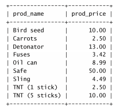

### 条件检测

#### AND操作符

与Python的and一样，必须多个条件同时成立才为true

```mysql
SELECT prod_id, prod_price, prod_name FROM prod_table WHERE vend_id=1003 AND prod_price <= 10;
```

输出结果：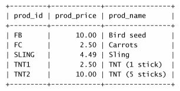


#### OR操作符

与Python中or一样，满足多个条件其中之一即为true

```mysql
SELECT prod_name, prod_price FROM prod_table WHERE vend_id=1002 OR vend_id=1003;
```

输出结果：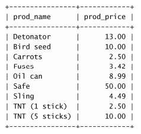

> **AND操作符的优先级比OR操作符优先级高，必要的时候，使用括号()**

#### NOT操作符

取反操作，此外MySQL中not操作允许对in，between，exists子句进行取反。

```mysql
SELECT prod_name, prod_price FROM prod_table WHERE vend_id NOT IN(1002, 1003);
```

选取厂商id不为1002，1003的所有商品，输出结果：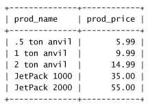


### 空值检测

NULL值，即为**无值（no value）**，与字段为0，空字符串，和空格不一样。通过**IS NULL操作符**可判断是否为null值。

```mysql
SELECT cust_id FROM prod_table WHERE cust_email IS NULL;
```

输出email值为null的厂商：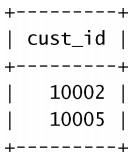


