REGEX -->与like的区别，^$实现like的功能

​	    --->BINARY区分大小写

​            --->使用|进行OR匹配

​	   ---->匹配几个字符之一使用[]--->匹配范围[1-5]

​	------>转义\\\，匹配特殊字符


计算字段

​	MySQL使用Concat函数实现拼接，大多数DBMS使用+或||进行拼接

​	AS 进行别名更改

​	执行算术运算

MySQL中函数

​	文本处理函数

​	时间处理函数：Date()处理时间类型

​	数值处理函数


组合聚集函数

​	COUNT()，AVG()，MAX()，MIN()，DISTINCT关键字


# MySQL进阶

------

**DATE: 2018-03-03**

**Author: Reborn**

-----


[TOC]


## 前言

正则表达式过滤，计算字段，MySQL中的常用函数。


## 正则表达式过滤

### REGEX关键字

regex关键字的使用跟like一样，但却更强大，通用性更高

```mysql
SELECT prod_name FORM prod_table WHERE prod_name REGEX '1000' OREDER BY prod_name;
```

输出结果：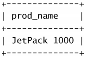

>   注意事项：这语句看起来跟like一模一样，但其实意义全然不同，对于like关键字，它是匹配全文为‘1000’的商品，而regex则表达的是正文为‘1000’的具体的正则表达式。此外将上面SQL语句中的regex改成like，并没有任何返回值，因为like语句需要加上通配符，才会有返回值。
>
>   regex想实现like的全文匹配，需要用上^和$两个字符。
>
>   MySQL的正则表达式匹配不区分大小，若想要区分大小写，需要加上BINARY关键字


### MySQL中匹配符

-   | ，进行OR匹配

    ```mysql
    SELECT prod_name from prod_table WHERE prod_name REGEX '1000|2000';
    ```

    输出结果：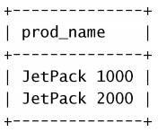

-   [...]，匹配中括号内任意字符，还可以写成[0-9]匹配0到9之间任意数字，[a-z]匹配a到z的任意字母

```mysql
SELECT prod_name from prod_table WHERE prod_name REGEX '[123] ton';
```

-   . ， 匹配任意字符

    ```mysql
    SELECT vend_name From vendors Where vend_name REGEX '.';
    ```

    输出结果：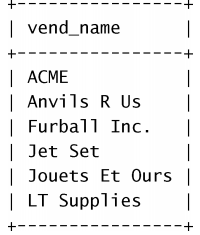

-   \\\，MySQL中的转义字符，\\\\f换页，\\\n换行，\\\r回车，\\\t制表，\\\v纵向制表

-   匹配字符类

    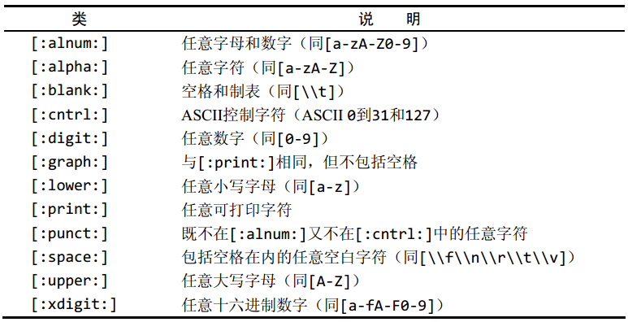

-   匹配多个字符

    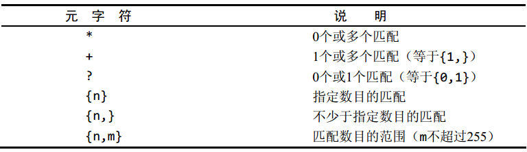

```mysql
SELECT prod_name FROM prod_table WHERE prod_name REGEX '[[:digit]]{4}';
```

输出结果：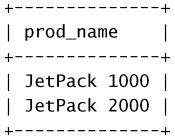


-   定位元字符

    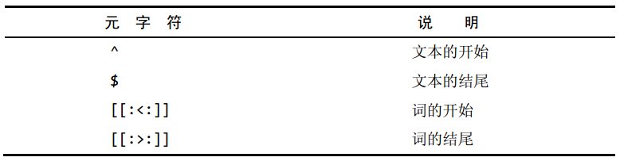


## 计算字段

### Concat()函数

Concat函数是MySQL用来实现拼接的函数，使用AS关键字可以给拼接的字段另起名字

```mysql
SELECT Concat(vend_name, ' (', vend_country, ')') FROM vendors ORDER BY vend_name;
```

输出结果： 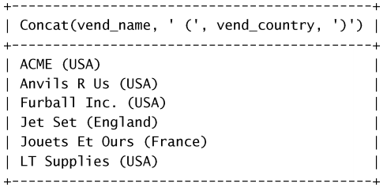

```mysql
SELECT Concat(vend_name, ' (', vend_country, ')') AS vend_title FROM vendors ORDER BY vend_name;
```

输出结果：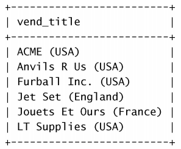

### 算术计算

MySQL可以执行简单的算术计算，如加减乘除

```mysql
SELECT prod_id, quantity, item_price, quantity*item_price AS expanded_price FROM orderitems WHERE order_num = 20005;
```

输出结果：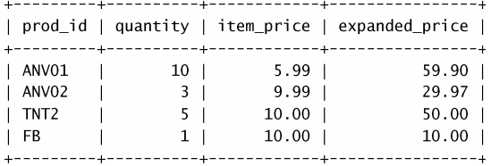

## MySQL中数据处理函数

### 文本处理函数

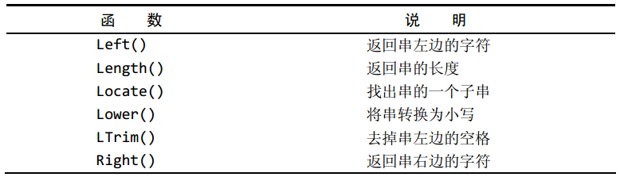

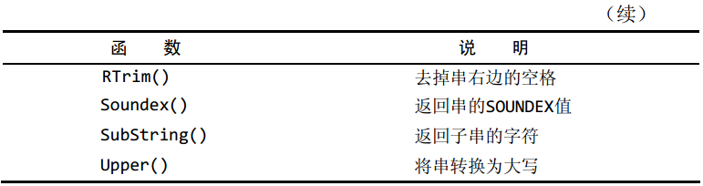

### 时间日期处理函数

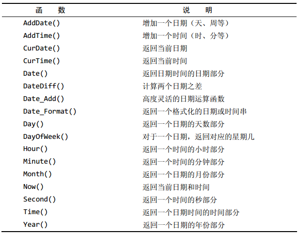

### 数值处理函数

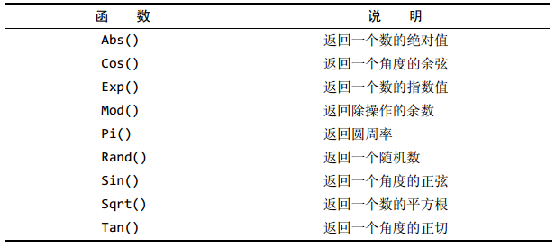

