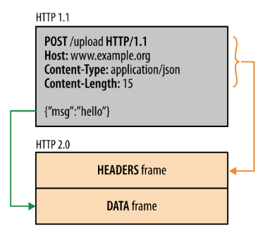

### 2XX

请求成功

- 200 正常处理
- 204 成功处理，蛋服务器没有新数据返回，显示页面不更新
- 206 对服务器进行范围请求，只返回一部分数据


### 3XX

表示重定向

- 301 *永久重定向*，请求资源已经分配了新的URI中，URL地址已经改变
- 302 *转发*，请求资源临时分配新的URI中，URL地址没有变
- 303 与302功能一样，但客户端请求方式为GET来获取资源
- 304 *返回未过期的缓存数据*，发送了附带请求，但不符合条件
- 307 与302功能一样，但客户端必须保持请求方法不变向新的地址发出请求


### 4XX

表示客户端出错

- 400 请求报文语法错误
- 401 需要认证身份
- 403 没有访问权限
- 404 服务器没有这个资源


### 5XX

表示服务器出错

- 500 内部资源出错
- 503 服务器繁忙


### HTTP请求报文

- 报文首部

  - 请求行（请求方式 链接 协议）
  - 首部字段

- 空行（CR+LF）

- 报文主体：GET请求，请求内容放在链接中；POST请求，请求内容放在报文主体中

  > 补充：GET产生一个TCP数据包；POST产生两个TCP数据包。
  >
  > 对于GET方式的请求，浏览器会把http header和data一并发送出去，服务器响应200（返回数据）；
  >
  > 而对于POST，浏览器先发送header，服务器响应100 continue，浏览器再发送data，服务器响应200 ok（返回数据）。（[链接](https://zhuanlan.zhihu.com/p/22536382)）

GET请求：

```
GET / HTTP/1.1
Host: www.baidu.com
Connection: keep-alive
Upgrade-Insecure-Requests: 1
User-Agent: Mozilla/5.0 (Macintosh; Intel Mac OS X 10_11_6) AppleWebKit/537.36 (KHTML, like Gecko) Chrome/54.0.2840.71 Safari/537.36
Accept: text/html,application/xhtml+xml,application/xml;q=0.9,image/webp,*/*;q=0.8
Accept-Encoding: gzip, deflate, sdch
Accept-Language: zh-CN,zh;q=0.8,en;q=0.6
Cookie: BAIDUID=4082549DEE5E64678FC46642E185D98C:FG=1;

```

POST请求：

```
POST / HTTP/1.1
Host: www.demo.com
Cache-Control: no-cache
Postman-Token: 81d7b315-d4be-8ee8-1237-04f3976de032
Content-Type: application/x-www-form-urlencoded

key=value&testKey=testValue
```


### HTTP响应报文

- 报文首部
  - 响应状态行（协议 HTTP状态码 描述结果）
  - 首部字段
- 空行（CR+LF）
- 响应正文

响应内容：

```
HTTP/1.1 200 OK
Date: Sat, 31 Dec 2005 23:59:59 GMT
Content-Type: text/html;charset=ISO-8859-1
Content-Length: 122

＜html＞
＜head＞
＜title＞Wrox Homepage＜/title＞
＜/head＞
＜body＞
＜!-- body goes here --＞
＜/body＞
＜/html＞
```


### 补充

> Http与Https的区别：

1. HTTP 的URL 以http:// 开头，而HTTPS 的URL 以https:// 开头
2. HTTP 是不安全的，而 HTTPS 是安全的
3. HTTP 标准端口是80 ，而 HTTPS 的标准端口是443
4. 在OSI 网络模型中，HTTP工作于应用层，而HTTPS 的安全传输机制工作在传输层
5. HTTP 无法加密，而HTTPS 对传输的数据进行加密
6. HTTP无需证书，而HTTPS 需要CA机构wosign的颁发的SSL证书


[HTTP面试题](https://mp.weixin.qq.com/s?__biz=MzI4Njg5MDA5NA==&mid=2247483733&idx=1&sn=f9ab8d07d2151bd40cdcd9a290317346&chksm=ebd74054dca0c942a36e6e63c783e9b1f414a16e2c702ae4b371a204960a50c7ae89af207139#rd)

【2018-10-31】

**HTTP内容补充增加**

###Cookie

HTTP协议是无状态的，因此在HTTP1.1中引入Cookie来保存状态信息。（随着现在浏览器的发展，Cookie不在浏览器客户端唯一存储客户端的存储，新的浏览器API中允许开发者将数据存储在本地中，使用Web storage API或者IndexedDB）。Cookie具有作用域的范围，默认情况下当前的主机访问（不包含子域名），可以通过修改Domain字段来指定哪些主机可以接受Cookie，另外也可以通过Path字段来指定哪些路径可以接受Cookie。**Cookie只允许储存ASCII 码字符串信息**。


### Session

HTTP交互中除了可以使用Cookie保存状态信息，也可以使用Session来保存状态信息。Cookie保存在客户端中，Session保存在服务器中，安全性相对更高。另外Session可以储存对象，而不仅仅只有字符串信息。Session还可以将其持久化，存储到数据库中。


Session维护状态：

1. 客户端中不禁用Cookie时，服务器端为客户端生成SessionID值，当用户正确验证后，服务器端会将SessionID值通过响应报文Set-Cookie字段，存储到浏览器的Cookie中。当客户端继续操作，就会将这个Cookie发给服务器。

2. 当客户端浏览器禁用Cookie时，此时便无法将SessionID中存储到Cookie中，此时便采用URL重写技术，将SessionID作为URL的参数进行传递。


### 缓存

首部字段有Etag字段，该字段的含义是资源的唯一标识，每次更新都会跟服务器端比较这个值是否相同，请求资源已经修改，会返回资源和状态码200 OK；请求资源未修改会返回304 Not Modified。


### HTTP/2.0

HTTP/2.0与HTTP/1.x的区别在于将原来报文分成两个帧分别是HEADERS帧和DATA帧，均为二进制格式。整个通信过程只有一个TCP连接存在，承载任意数量的双向数据流。




HTTP/2.0中服务器会将客户端所需要的资源一起发送给客户端，不需要客户端重复发送多个请求。HTTP/2.0还会维护和更新首部字段表，避免重复传输，同时还对首部字段进行Huffman编码。


