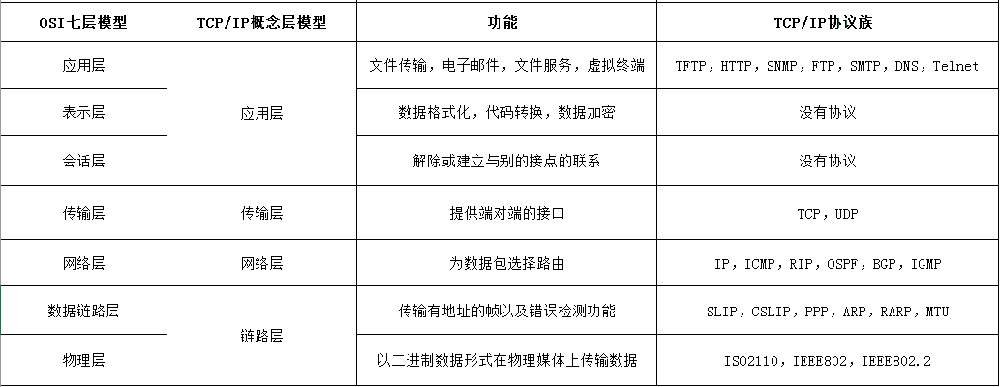
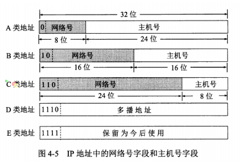
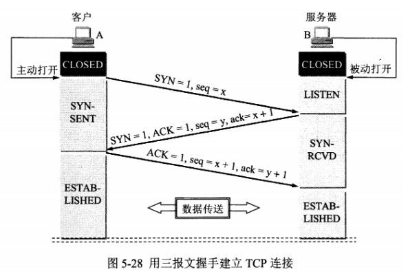
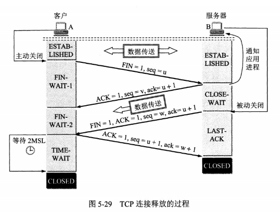

# 计算机网络体系结构

## 五层协议

-   应用层：为特定应用程序提供数据传输服务，数据单位为报文
-   运输层：提供的是进程间的通用数据传输服务。主要有两种协议：提供面向连接，可靠的数据传输服务的TCP；另外一种提供无连接的数据传输服务的UDP协议
-   网络层：为主机间提供数据传输服务，将运输层传递下来的报文段或用户数据报封装并分组
-   数据链路层：为同一链路的主机提供服务，将网络层传输下来的数据包封装成帧
-   物理层：在传输媒体上传输数据比特流，物理层的作用是尽可能的屏蔽传输媒体和通信手段的差异

## OSI中细分

-   应用层：统一数据压缩，加密以及数据描述
-   回话层：建立以及管理回话

## TCP/IP协议

TCP/IP协议族中，IP协议很重，TCP和UDP协议都是基于IP协议，因此形状有点像沙漏形状。

## 名词解释

### 数据链路层

1.  透明传输

    数据链路层把网络层的数据包封装成帧，通过添加帧首部和帧尾部标志帧的开始和结束，若在数据包中出现了帧首部和帧尾部的特殊字符时，会导致帧的开始和结束位置出错，因此会在数据部分出现帧首部和帧尾部相同内容的地方加上转义字符，另外也要在转义字符前插入转义字符，在接收端，去除转义字符内容，还原原始数据。透明传输的东西就是转义字符，相当于没有添加过这东西。

2.  差错检测

    数据链路层采用循环冗余检验（CRC）来检测比特差错。

3. 交换机

   存储着一张交换表，里面记录着mac地址及其对应的接口

### 网络层

网络层使用IP协议将所有异构网络连接起来。网络除IP协议之外，还有ARP（地址解析协议，将IP地址转换成对应mac地址）， ICMP（网际控制报文协议，有差错报文和询问报文两种，常见的应用有Ping和Traceroute）， IGMP（网际组管理协议，用于管理组成员关系，帮助多播路由器创建和更新与每一个路由器有关的成员）

#### 关于IP地址

有三种分类方式：

1. 有网络号和主机号构成，其中不同类的网路号具有不同的固定长度

   

2. 将主机号中前几位作为子网号，IP地址=｛<网络号>,<子网号>,<主机号>｝，将1中的二级地址转换成三级地址，同时需要配置一个子网掩码。

3. 采用网络前缀进行编码，即无分类编址CIDR，IP地址=｛<网络前缀号>,<主机号>｝，e.g CIDR的表示ip地址形式为128.14.35.7/20 表示前 20 位为网络前缀。路由表项目由“网络前缀”和“下一跳地址”构成，可以解决随着路由表条目增多，交换路由信息开销增大的问题。

 

#### 路由器分组转发流程

- 从数据报的首部中目的地址IP，得到目的地址的网络前缀N
- 如果目的地址直接与路由器相连，则直接交付即可。
- 如果没有直接相连，但是路由表中有其对应网络N特定主机路由，则把数据包传给表中的下一跳路由
- 如果没有符合规则的路由，最后将其转发给默认路由器，否则报告转发错误报文

### 传输层

传输层提供进程间通信，主要有以下两种协议：

- 传输控制协议TCP：面向连接，提供可靠交付，有流量控制，拥塞控制的功能，提供全双工通信，面向字节流，一对一。
- 用户数据报协议UDP：无连接，不可靠（尽最大可能）交付，面向报文（在应用层传下来的报文只做添加UDP首部操作），支持一对多，一对一，多对多等交互通信。

#### TCP三次握手流程

A跟B建立TCP连接

1. A向B发送SYN=1，seq=x请求建立连接
2. B收到SYN请求后，同意建立连接，向A发送确认报文，SYN=1，ACK=1（确认连接），ack=x+1（确认编号），seq=y
3. A收到B的确认信号，再向B发送确认报文，ACK=1，ack=y+1，seq=x+1

**之所以要三次握手，就是为了防止已经失效的连接请求，导致服务器错误建立连接。**

#### TCP四次挥手

1. A向B发送释放连接报文，FIN=1
2. B收到后，向A发送确认报文，此时TCP属于半关闭的状态（B仍可向A发送数据）
3. 当过了FIN-WAIT-2时候，确认不在连接时，B向A发送释放连接报文，FIN=1
4. A收到B的释放连接报文是，等待2个MSL（最大报文存活时间），发送确认信号，释放连接
5. B收到后，也会释放连接

**等待2MSL的作用：1. 确保最后一个确认报文能够到达；2. 让本连接所有报文在等待时间中都从网络中消失，使得新连接中不会有旧连接的请求**

TCP的其他特性，详看[这篇文章](./计算机网络知识点总结.md)

> 一下Web页面请求过程，摘抄自CyC2018的[CS-Notes](https://github.com/CyC2018/CS-Notes/blob/master/notes/%E8%AE%A1%E7%AE%97%E6%9C%BA%E7%BD%91%E7%BB%9C.md#web-%E9%A1%B5%E9%9D%A2%E8%AF%B7%E6%B1%82%E8%BF%87%E7%A8%8B)，因为很详细。

## Web 页面请求过程

### 1. DHCP 配置主机信息

- 假设主机最开始没有 IP 地址以及其它信息，那么就需要先使用 DHCP 来获取。
- 主机生成一个 DHCP 请求报文，并将这个报文放入具有目的端口 67 和源端口 68 的 UDP 报文段中。
- 该报文段则被放入在一个具有广播 IP 目的地址(255.255.255.255) 和源 IP 地址（0.0.0.0）的 IP 数据报中。
- 该数据报则被放置在 MAC 帧中，该帧具有目的地址 FF:FF:FF:FF:FF:FF，将广播到与交换机连接的所有设备。
- 连接在交换机的 DHCP 服务器收到广播帧之后，不断地向上分解得到 IP 数据报、UDP 报文段、DHCP 请求报文，之后生成 DHCP ACK 报文，该报文包含以下信息：IP 地址、DNS 服务器的 IP 地址、默认网关路由器的 IP 地址和子网掩码。该报文被放入 UDP 报文段中，UDP 报文段有被放入 IP 数据报中，最后放入 MAC 帧中。
- 该帧的目的地址是请求主机的 MAC 地址，因为交换机具有自学习能力，之前主机发送了广播帧之后就记录了 MAC 地址到其转发接口的交换表项，因此现在交换机就可以直接知道应该向哪个接口发送该帧。
- 主机收到该帧后，不断分解得到 DHCP 报文。之后就配置它的 IP 地址、子网掩码和 DNS 服务器的 IP 地址，并在其 IP 转发表中安装默认网关。

### 2. ARP 解析 MAC 地址

- 主机通过浏览器生成一个 TCP 套接字，套接字向 HTTP 服务器发送 HTTP 请求。为了生成该套接字，主机需要知道网站的域名对应的 IP 地址。
- 主机生成一个 DNS 查询报文，该报文具有 53 号端口，因为 DNS 服务器的端口号是 53。
- 该 DNS 查询报文被放入目的地址为 DNS 服务器 IP 地址的 IP 数据报中。
- 该 IP 数据报被放入一个以太网帧中，该帧将发送到网关路由器。
- DHCP 过程只知道网关路由器的 IP 地址，为了获取网关路由器的 MAC 地址，需要使用 ARP 协议。
- 主机生成一个包含目的地址为网关路由器 IP 地址的 ARP 查询报文，将该 ARP 查询报文放入一个具有广播目的地址（FF:FF:FF:FF:FF:FF）的以太网帧中，并向交换机发送该以太网帧，交换机将该帧转发给所有的连接设备，包括网关路由器。
- 网关路由器接收到该帧后，不断向上分解得到 ARP 报文，发现其中的 IP 地址与其接口的 IP 地址匹配，因此就发送一个 ARP 回答报文，包含了它的 MAC 地址，发回给主机。

### 3. DNS 解析域名

- 知道了网关路由器的 MAC 地址之后，就可以继续 DNS 的解析过程了。
- 网关路由器接收到包含 DNS 查询报文的以太网帧后，抽取出 IP 数据报，并根据转发表决定该 IP 数据报应该转发的路由器。
- 因为路由器具有内部网关协议（RIP、OSPF）和外部网关协议（BGP）这两种路由选择协议，因此路由表中已经配置了网关路由器到达 DNS 服务器的路由表项。
- 到达 DNS 服务器之后，DNS 服务器抽取出 DNS 查询报文，并在 DNS 数据库中查找待解析的域名。
- 找到 DNS 记录之后，发送 DNS 回答报文，将该回答报文放入 UDP 报文段中，然后放入 IP 数据报中，通过路由器反向转发回网关路由器，并经过以太网交换机到达主机。

### 4. HTTP 请求页面

- 有了 HTTP 服务器的 IP 地址之后，主机就能够生成 TCP 套接字，该套接字将用于向 Web 服务器发送 HTTP GET 报文。
- 在生成 TCP 套接字之前，必须先与 HTTP 服务器进行三次握手来建立连接。生成一个具有目的端口 80 的 TCP SYN 报文段，并向 HTTP 服务器发送该报文段。
- HTTP 服务器收到该报文段之后，生成 TCP SYN ACK 报文段，发回给主机。
- 连接建立之后，浏览器生成 HTTP GET 报文，并交付给 HTTP 服务器。
- HTTP 服务器从 TCP 套接字读取 HTTP GET 报文，生成一个 HTTP 响应报文，将 Web 页面内容放入报文主体中，发回给主机。
- 浏览器收到 HTTP 响应报文后，抽取出 Web 页面内容，之后进行渲染，显示 Web 页面。