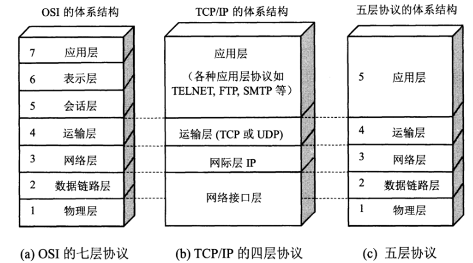
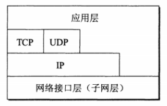
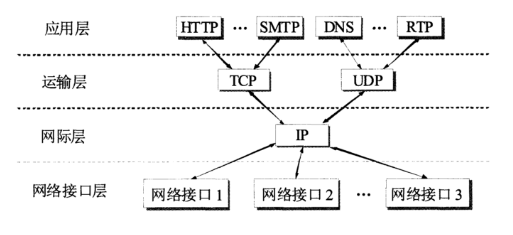

# 计算机网络体系结构

## 五层协议

-   应用层：为特定应用程序提供数据传输服务，数据单位为报文
-   运输层：提供的是进程间的通用数据传输服务。主要有两种协议：提供面向连接，可靠的数据传输服务的TCP；另外一种提供无连接的数据传输服务的UDP协议
-   网络层：为主机间提供数据传输服务，将运算层传递下来的报文段或用户数据报封装并分组
-   数据链路层：为同一链路的主机提供服务，将网络层传输下来的数据包封装成帧
-   物理层：在传输媒体上传输数据比特流，物理层的作用是尽可能的屏蔽传输媒体和通信手段的差异

## OSI中细分

-   应用层：统一数据压缩，加密以及数据描述
-   回话层：建立以及管理回话

## TCP/IP协议

TCP/IP协议族中，IP协议很重，TCP和UDP协议都是基于IP协议，因此形状有点像沙漏形状。

## 名词解释

1.  透明传输

    数据链路层把网络层的数据包封装成帧，通过添加帧首部和帧尾部标志帧的开始和结束，若在数据包中出现了帧首部和帧尾部的特殊字符时，会导致帧的开始和结束位置出错，因此会在数据部分出现帧首部和帧尾部相同内容的地方加上转义字符，另外也要在转义字符前插入转义字符，在接收端，去除转义字符内容，还原原始数据。透明传输的东西就是转义字符，相当于没有添加过这东西。

2.  差错检测

    数据链路层采用循环冗余检验（CRC）来检测比特差错。