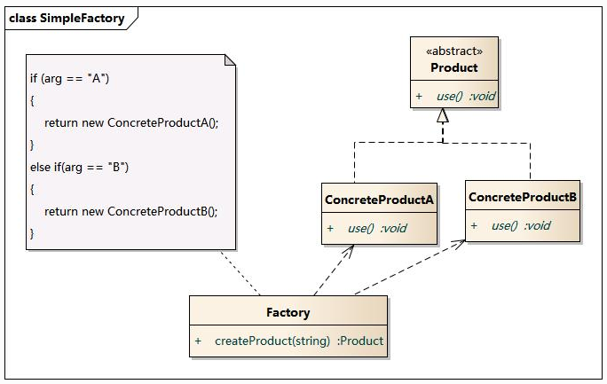
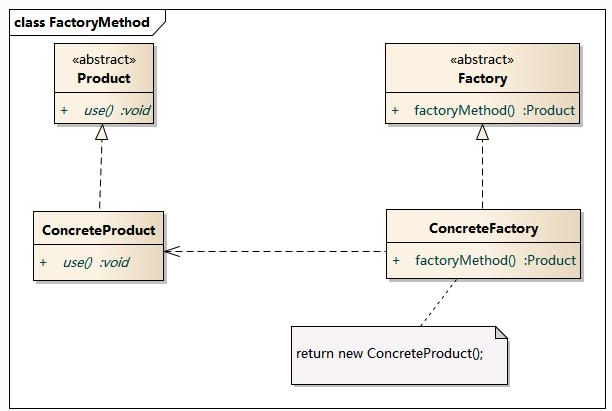
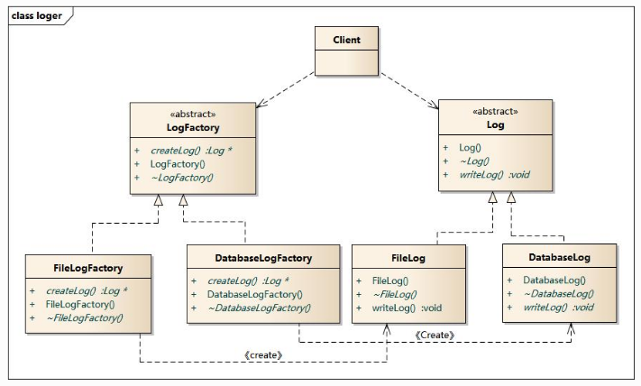
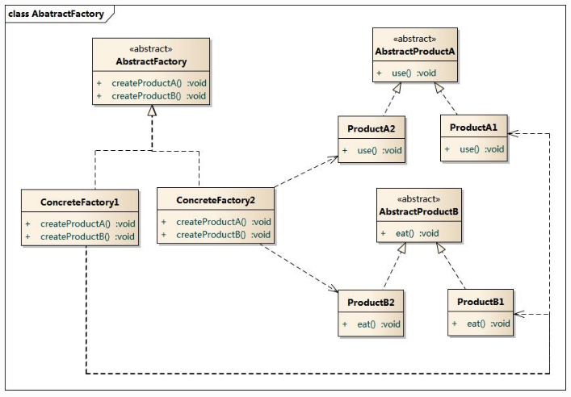

# 创建型模式
创建型模式对类的实例化过程进行了抽象，将软件模块中对象的创建和对象的使用分离。

有以下几种模式：
- 简单工厂模式
- 工厂方法模式
- 抽象工厂模式
- 建造者模式
- 原型模式
- 单例模式

## 简单工厂模式
简单工厂模式（Simple Factory Pattern）又称为静态工厂模式（Static Factory Method），为类创建型模式，根据参数的不同返回不同类的实例。被创建实例通常都具有共同的父类。

- Factory: 负责实现创建所有实例的内部逻辑。
- Product: 抽象产品角色是所创建的所有对象的父类，负责描述所共有的公共接口
- ConcreteProduct: 是创建目标，所有创建对象都充当这个角色的某个具体类的实例

### 代码展示
```java
abstract class Product {
}

class ProductA extends Product {

	public ProductA() {
		System.out.println("A");
	}
}

class ProductB extends Product {

	public ProductB() {
		System.out.println("B");
	}
}

public class factoryOfProduct {
	public static Product createProduct(String proname) {
		if("A".equals(proname)) {
			return new ProductA();
		}

		if("B".equals(proname)) {
			return new ProductB();
		}
	}
}
```

### 优缺点
- 优点
	- 客户端可以免除直接创建产品对象的责任，由工厂类决定创建产品类实例
	- 客户端无须知道产品类的类名，只需要知道对应参数机壳
	- 可以通过引入配置文件，在不修改任何客户端代码情况下更换和增加新的具体产品类，在一定程度提高系统灵活性

- 缺点
	- 工厂类集中所有产品的创建逻辑，一旦不能正常工作时，整个系统可能会受到影响
	- 当产品过多时，可能会导致系统过于臃肿，不利于维护和扩展
	- 由于使用静态方法，因此无法造成工厂角色无法基于继承的等级结构

### 适用范围
- 产品类较少的情况
- 工厂业务逻辑无须太过复杂的情况
- 客户端只需要知道传入工厂类的参数，不关心创建对象时


## 工厂方法模式
工厂方式模式(Factory Method Pattern)：又称为虚拟构造器（Virtual Constructor）模式或者多态工厂（Polymorphic Factory）模式，属于类创建型模式。在此模式中，工厂父类负责定义创建产品对象的公共接口，工厂自雷负责生产具体的产品对象，即通过工厂子类来确定实例化哪一类具体产品类。

- Product：抽象产品类
- ConcreteProduct：具体产品类
- Factory：抽象工厂类
- ConcreteFactory：具体工厂类

### 代码展示
```java
abstract class Product {
	void use();
}

class ConcreteProduct extends Product {
	void use() {
		System.out.println("ConcreteProduct using");
	}
}

abstract class Factory {
	Product factoryMethod();
}

class ConcreteFactory extends Factory {
	Product factoryMethod() {
		return new ConcreteProduct();
	}
}
```

### 优缺点
工厂方法模式是简单工厂模式的进一步抽象，核心工厂类负责定义公共接口，创建产品类实例则由各个工厂子类具体实现，这样可以在不改变核心工厂类的情况下，通过定义新的工厂子类，创建新的产品。例如日志记录器：

- 优点
	- 多态性，所有工厂子类都继承自同一抽象工厂类
	- 引入新产品，无需修改核心工厂类的代码，只需要添加具体工厂子类和产品类，客户端无需修改
	- 工厂子类封装了创建子类的过程，客户端只需要知道接口是什么即可创建新的产品类、
- 缺点
	- 需要新增新的类，可能会增加系统复杂度，增加编译时间
	- 再考虑到系统的可扩展性和简易使用性，会引入反射，DOM等技术，增加系统的实现难度

## 抽象工厂模式
抽象工厂模式（Abstract Factory）：提供一个创建一系列相关或者相互依赖对象的接口，而无须制定他们具体的类。抽象工厂模式又称为Kit模式，属于对象创建型模式。在工厂方法模式基础上，增加不同类之间的组合。


- AbStractFactory：抽象工厂类
- ConcreteFactory：具体工厂类
- AbstractProduct：抽象产品类
- Product：具体产品类

### 模式分析
该模式比较适合于一个产品族，而且同一个产品族的产品将在一起使用的系统中。因此不同产品的相互组合，只需要实现新的具体工厂类即可。缺点也很明显，需要新增产品类时，需要修改抽象工厂类的接口，重新实现新的工厂类。

## 建造者模式
建造者模式（Builder Pattern）：也可以称之为生成器模式，将一个复杂对象的构建与它的组成分离，是的同样的构建过程可以创建不同的表示。

- Builder: 抽象建造者
- ConcreteBuilder: 具体建造者
- Director: 指挥者
- Product： 产品角色

### 代码展示
```java
abstract Builder {
	void buildPartA();
	void buildPartB();
}

class ConcreteBuilder extends Builder {
	Product product;
	Product getProduct(){

	}
}

class Director {
	Builder pbuilder;
	public Director() {}
	Product constuct() {
		returu pbuilder.getProduct();
	}

	void setBuilder(Builder builder) {
		this.pbuilder = builder;
	}
}
```
### 适用环境
- 需要生成的产品对象有复杂的内部结构，这些产品对象通常包含多个成员属性
- 需要生成的产品对象属性相互依赖，需要指定其生成顺序
- 对象的创建过程独立于创建该对象的类，将创建的过程封装在指挥者勒种
- 隔离复杂对象的创建和使用，并使得相同的创建过程可以创建不同的产品

将抽象工厂模式看成汽车配件生产工厂，建造者模式则是一个汽车组装工厂。