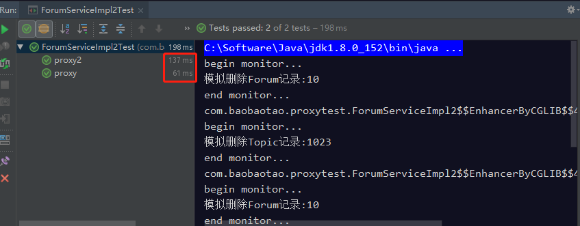
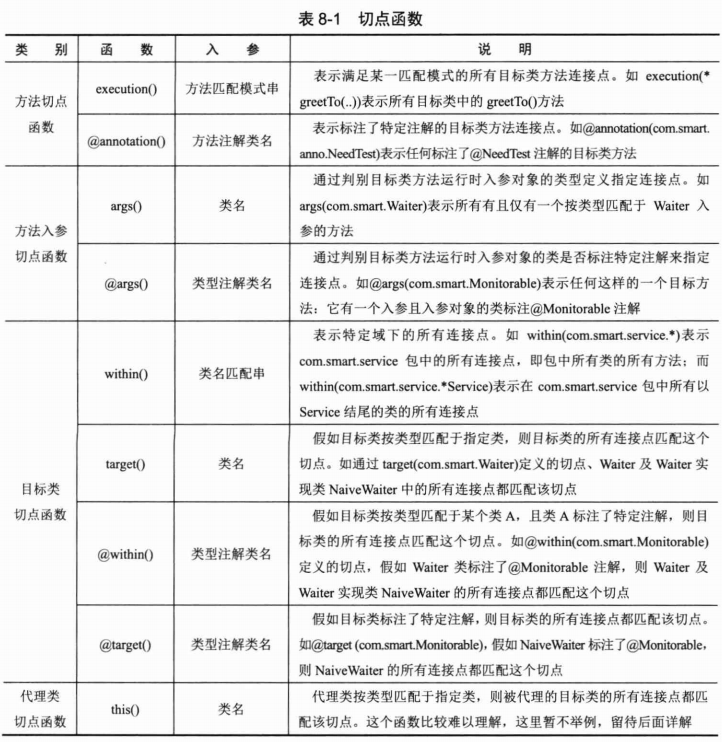

## Spring的AOP

AOP：面向切面编程，具体是指在不同功能类中出现的相同的功能点，将这些功能点横向切割出来，与业务逻辑类分开。

### 相应术语

- 连接点（Joinpoint）：程序执行的某个特定位置。
- 切点（Pointcut）：用于定位连接点。
- 增强（Advice）：织入目标类连接点上一段程序代码。
- 目标对象（Target）：织入的目标类。
- 引介（Introduction）：特殊的增强，为类添加一些属性和方法。
- 织入（Weaving）：将增强添加到目标类的连接点上的过程，有编译期织入，类装载期织入，动态代理织入。*Spring采用动态代理织入，AspectJ采用编译期织入和类装载期织入*。
- 代理（Proxy）：一个类被AOP织入增强后，产生的结果类，融合袁磊和增强逻辑的代理类。
- 切面（Aspect）：由切点和增强组成，包括横切逻辑的定义和连接点的定义。


### 代理

#### JDK动态代理

JDK动态代理涉及java.lang.reflect包中两个类：Proxy和InvocationHandler。

- InvocationHandler是一个接口，可以通过实现该接口定义横切逻辑，并通过反射机制调用目标类的代码，动态地将横切逻辑和业务逻辑编织在一起
- Proxy利用InvocationHandler动态创建一个符合某一接口的实例，生成目标类的代理对象。

```java
//ForumServiceImpl2
public class ForumServiceImpl2 implements ForumService{
    @Override
    public void removeTopic(int topicId) {

        System.out.println("模拟删除Topic记录:"+topicId);
        try {
            Thread.currentThread().sleep(20);

        } catch (InterruptedException e) {
            throw new RuntimeException(e);
        }

    }

    @Override
    public void removeForum(int forumId) {
        System.out.println("模拟删除Forum记录:"+forumId);
        try {
            Thread.currentThread().sleep(40);
        } catch (InterruptedException e) {
            throw new RuntimeException(e);
        }

    }
}
```

```java
//PerformanceHandler.java
public class PerformanceHandler implements InvocationHandler {

    private Object target;

    public PerformanceHandler(Object target) {
        this.target = target;
    }

    @Override
    public Object invoke(Object proxy, Method method, Object[] args) throws
            Throwable {
        //这里就实现了切面逻辑和业务逻辑交织
        PerformanceMonitor.begin(target.getClass().getName()+"."+method.getName());
        Object obj = method.invoke(target, args);//通过反射方法调用业务类的目标方法
        PerformanceMonitor.end();

        return obj;
    }
}
```

```java
public class ForumServiceImpl2Test {

    @Test
    public void proxy() {
        //目标
        ForumService target = new ForumServiceImpl2();
	    //切面
        PerformanceHandler handler = new PerformanceHandler(target);
	    //代理类
        ForumService proxy = (ForumService) Proxy.newProxyInstance(target.getClass()
                .getClassLoader(), target.getClass().getInterfaces(), handler);
        //这里只能强制转换成接口类型

        proxy.removeForum(10);//实际上是调用invoke(proxy, removeForum, new Object[]{10})
        proxy.removeTopic(1012);
    }

}
```

JDK创建代理，只能为接口创建代理，可以看Test方法proxy变量。


#### CGLib代理

CGLib采用底层的字节码技术，可以为一个类创建子类，在子类中采用方法拦截的技术拦截所有父类方法的调用并顺势织入横切逻辑。

```java
import org.springframework.cglib.proxy.Enhancer;
import org.springframework.cglib.proxy.MethodInterceptor;
import org.springframework.cglib.proxy.MethodProxy;

import java.lang.reflect.Method;

public class CglibProxy implements MethodInterceptor {

    private Enhancer enhancer = new Enhancer();

    public Object getProxy(Class clazz) {
        enhancer.setSuperclass(clazz);//设置需要创建子类的类
        enhancer.setCallback(this);
        return enhancer.create();//通过字节码技术动态创建子类实例
    }


    @Override
    public Object intercept(Object o, Method method, Object[] objects, MethodProxy methodProxy) throws Throwable {
        //该方法可以拦截父类所有方法
        PerformanceMonitor.begin(o.getClass().getName()+"."+method.getName());
        Object result = methodProxy.invokeSuper(o, objects);
        PerformanceMonitor.end();

        return result;
    }
}
```

```java
 public class ForumServiceImpl2Test {

    @Test
    public void proxy2() {
        CglibProxy proxy = new CglibProxy();
        ForumServiceImpl2 forumServiceImpl2 = (ForumServiceImpl2)proxy
                .getProxy(ForumServiceImpl2.class);
        forumServiceImpl2.removeForum(10);
        forumServiceImpl2.removeTopic(1023);
    }
}
```

CGLib采用动态创建子类的方式生成代理对象，所以不能对目标类中final和private方法进行代理。


另外对比，在我机子上，JDK代理运行速度比CGLib代理要稍快一些。因此CGLib动态代理技术适用于无需频繁创建代理对象，JDK代理则适用于频繁创建代理对象。




### AspectJ使用

```java
public class NaiveWaiter2 implements Waiter {

    @Override
    public void greetTo(String clientName) {
        System.out.println("NaiveWaiter:greet to "+clientName+" ...");
    }

    @Override
    public void serveTo(String clientName) {
        System.out.println("NaiveWaiter:serving "+clientName+" ...");
    }
}
```

```java
import org.aspectj.lang.annotation.Aspect;
import org.aspectj.lang.annotation.Before;

@Aspect//声明其为一个切面
public class PreGreetingAspect {
    @Before("execution(* greetTo(..))")//声明以下方法在什么时候执行
    public void beforeGreeting() {
        System.out.println("How are you");
    }
}

```

切面编程测试

```java
public class ToolTest {

    @Test
    public void aspectTest() {
        Waiter target = new NaiveWaiter2();
        AspectJProxyFactory factory = new AspectJProxyFactory();
        //设置对象
        factory.setTarget(target);
        //添加切面类
        factory.addAspect(PreGreetingAspect.class);
        //生成代理对象
        Waiter proxy = factory.getProxy();

        proxy.greetTo("John");
        proxy.serveTo("John");
    }
}
```

AspectJ在Spring中的使用，同样是采用xml配置文件，在Bean的xml中引入aop命名空间，加上**<aop:aspectj-autoproxy />**（其中有个proxy-target-class属性，默认为false采用JDK动态代理技术，为true时采用CGLib动态代理），这会自动为Spring容器中那些匹配@Aspect切面的Bean创建代理，完成切面织入。


#### AspectJ语法



以上表中所展示的@Aspect函数可以在Spring中，其他未在表上展示的@Aspect函数一般都不能在Spring上使用，否则会报IllegalArgumentException异常。


**关于通配符：**

- *：匹配任意字符，只能匹配上下文中一个元素
- ..：匹配任意字符，可以匹配上下文中多个元素，表示类时，必须和*联合使用，表示入参时候，单独使用。
- +：表示按类型匹配指定类的所有类（继承或扩展指定类，亦包括类本身），必须跟在类名后面。
- execution()和within()支持所有通配符
- 仅支持+同配置：args()，this()，target()，但意义不大
- 注解类型不支持通配符。

**关于逻辑运算符：**

- &&：与操作符
- ||：或操作符
- ！：非操作符

> AspectJ不支持and，or和not操作符，但是Spring在xml配置文件中定义切点表达式定义添加的等价操作符。


