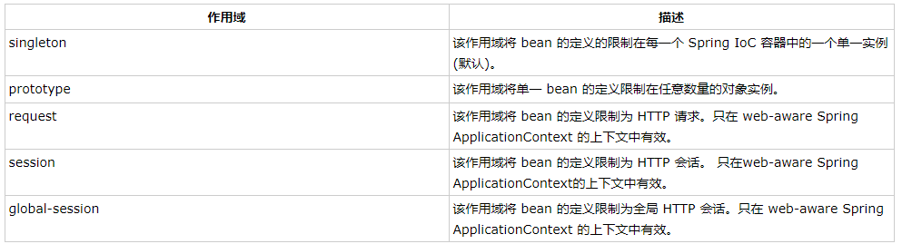

## Spring中常见注解
@Component:标注一个普通的Spring Bean类

@Respository：标注一个DAO的组件类

@Service：标注一个业务逻辑组件类

@Controller：标注一个控制器组件类

@Autowired：可用于为类的属性、构造器、方法进行注值


## Spring技术：

依赖注入（DI）：控制反转（IOC）的一种具体实现

​	注入方式有：通过构造函数传递参数的方式，通过使用setter方法的等等

面向切面的编程（AOP）：一个程序中跨越多个点的功能称为**横切关注点** ，独立于业务逻辑，如日志记录、声明性事物、安全性以及缓存等等。

AOP将横切关注点从他们所影响的对象中分离出来，DI则将应用程序彼此分离出来。


Spring Hello World实例：

首先定义一个HelloWorld类，有message属性以及相关的setter和getter方法，然后在MainApp文件中使用ClassPathXmlApplicationContext(“xxx.xml”)创建应用程序的上下文，创建初始化beans的配置文件所有的对象，之后可以通过getBean方法获取所需要的bean，根据bean的ID获取对象。在xml配置文件创建自己需要的实例化对象，从而不需要修改HelloWorld.java和MainApp.java文件。


Spring的BeanFactory容器：常用在移动设备和applet的应用中

最常用的XmlBeanFactory，通过xml加载初始化bean


Spring的ApplicationContext容器：

​	常用的：

​	FileSystemXmlApplicationContext：需要提供xml文件的绝对路径，该容器会从xml中加载已被定义的bean，

​	ClassPathXmlApplicationContext：在CLASSPATH环境变量中搜索XML配置文件，该容器就会从xml中加载配置文件，

​	WebXmlApplicationContext：在web应用程序的范围内加载xml配置文件


Bean：

​	bean是一个被实例化，组装，并且被Spring IOC容器所管理的对象。bean是由容器通过配置元数据创建的。

配置元数据对应bean定义的属性：


## Spring配置元数据：

### XML方式：

```xml
<?xml version="1.0" encoding="UTF-8"?>

<beans xmlns="http://www.springframework.org/schema/beans"
    xmlns:xsi="http://www.w3.org/2001/XMLSchema-instance"
    xsi:schemaLocation="http://www.springframework.org/schema/beans
    http://www.springframework.org/schema/beans/spring-beans-3.0.xsd">

   <bean id="helloWorld" class="com.tutorialspoint.HelloWorld" lazy-init="true" lazy-method="..." destroy-method="...">
       <property name="message" value="Hello World!"/>
   </bean>

</beans>
```

### 基于注解的配置方式：

- @Require：应用于bean属性的setter方法。
- @Autowired：应用于bean属性的setter方法和非setter方法，构造函数和属性。
- @Qualifier：通过指定确切的将被连线的bean，通常和@Autowired一起使用来删除混乱。
- JSR-250 Annotation

在IoC容器可以看到实例。

### 基于Java的配置方式：

以上两种方式都是需要配置xml的基础上编写spring bean，但是基于java config，可以在不用编写xml上完成spring bean的配置。

- @Configuration：表明该类可以使用Spring IoC容器作为bean的定义来源
- @Bean：将方法名作为bean的id
- @Import(xxx.class)：允许加载另外一个配置类@Bean定义
- 生命周期回调：@Bean(initMethod="xxx", destoryMethod="xxx")
- @Bean注解下可以使用@Scope注解指定Bean的范围

### IoC容器

Bean的scope属性：



```xml
<bean id="helloWorld" scope="singleton">
       <property name="message" value="Hello World!"/>
 </bean>
```


Bean的生命周期：

​	初始化回调：类可以通过实现*org.springframework.beans.factory.InitializingBean* 的void afterPropertiesSet()，也可以通过XML的配置元数据中init-method指定一个void无参方法。

```jav
public class ExampleBean implements InitializingBean {
   @Overwrite	
   public void afterPropertiesSet() {
      // do some initialization work
   }
}
```

```
<bean id="exampleBean" 
         class="examples.ExampleBean" init-method="init"/>
         
//在类中定义一下方法
public class ExampleBean {
    public void init() {}
}
```


​	销毁回调：通过可以通过实现*org.springframework.beans.factory.DisposableBean*的destory方法，亦或者在xml中配置destory-method属性

```
public class ExampleBean implements DisposableBean {
   @Overwrite
   public void destroy() {
      // do some destruction work
   }
}
```

```
<bean id="exampleBean"
         class="examples.ExampleBean" destroy-method="destroy"/>
         
public class ExampleBean {
   public void destroy() {
      // do some destruction work
   }
}
```

Spring的BeanPostProcessor:Bean的后置处理器

​	BeanPostProcessor接口定义了回调方法，可以通过这些方法实现自己的实例化逻辑，依赖解析等等，也可以对bean对象实例进行操作。

```java
/*HelloWorld.java*/
public class HelloWorld {
   private String message;
   public void setMessage(String message){
      this.message  = message;
   }
   public void getMessage(){
      System.out.println("Your Message : " + message);
   }
   public void init(){
      System.out.println("Bean is going through init.");
   }
   public void destroy(){
      System.out.println("Bean will destroy now.");
   }
}
/*InitHelloWorld.java*/
import org.springframework.beans.factory.config.BeanPostProcessor;
import org.springframework.beans.BeansException;
public class InitHelloWorld implements BeanPostProcessor {
   public Object postProcessBeforeInitialization(Object bean, String beanName) throws BeansException {
      System.out.println("BeforeInitialization : " + beanName);
      return bean;  // you can return any other object as well
   }
   public Object postProcessAfterInitialization(Object bean, String beanName) throws BeansException {
      System.out.println("AfterInitialization : " + beanName);
      return bean;  // you can return any other object as well
   }
}
/*MainApp.java*/
import org.springframework.context.support.AbstractApplicationContext;
import org.springframework.context.support.ClassPathXmlApplicationContext;
public class MainApp {
   public static void main(String[] args) {
      AbstractApplicationContext context = new ClassPathXmlApplicationContext("Beans.xml");
      HelloWorld obj = (HelloWorld) context.getBean("helloWorld");
      obj.getMessage();
      context.registerShutdownHook();//关闭hook，确保bean被销毁
   }
}

/*Beans.xml*/
<?xml version="1.0" encoding="UTF-8"?>

<beans xmlns="http://www.springframework.org/schema/beans"
    xmlns:xsi="http://www.w3.org/2001/XMLSchema-instance"
    xsi:schemaLocation="http://www.springframework.org/schema/beans
    http://www.springframework.org/schema/beans/spring-beans-3.0.xsd">

   <bean id="helloWorld" class="com.tutorialspoint.HelloWorld"
       init-method="init" destroy-method="destroy">
       <property name="message" value="Hello World!"/>
   </bean>

   <bean class="com.tutorialspoint.InitHelloWorld" order="..可以用来定义执行前后的顺序..."/>

</beans>
```


依赖注入（DI）：

- 构造器式注入：依赖性更强，传递参数可通过按顺序，传递参数属性亦或着索引。

```java
public class TextEditor {
   private SpellChecker spellChecker;
   private String name;
   public TextEditor( SpellChecker spellChecker, String name ) {
      this.spellChecker = spellChecker;
      this.name = name;
   }
   public SpellChecker getSpellChecker() {
      return spellChecker;
   }
   public String getName() {
      return name;
   }
   public void spellCheck() {
      spellChecker.checkSpelling();
   }
}
```


```xml
<?xml version="1.0" encoding="UTF-8"?>

<beans xmlns="http://www.springframework.org/schema/beans"
    xmlns:xsi="http://www.w3.org/2001/XMLSchema-instance"
    xsi:schemaLocation="http://www.springframework.org/schema/beans
    http://www.springframework.org/schema/beans/spring-beans-3.0.xsd">

   <!-- Definition for textEditor bean -->
   <bean id="textEditor" class="com.tutorialspoint.TextEditor" 
      autowire="constructor">
      <constructor-arg value="Generic Text Editor"/>
   </bean>

   <!-- Definition for spellChecker bean -->
   <bean id="SpellChecker" class="com.tutorialspoint.SpellChecker">
   </bean>

</beans>
```


- setter方式注入：可解耦合性更高

```java
public class Foo {
   public Foo(Bar bar, Baz baz) {
      // ...
   }
}
```

```xml
<?xml version="1.0" encoding="UTF-8"?>

<beans xmlns="http://www.springframework.org/schema/beans"
    xmlns:xsi="http://www.w3.org/2001/XMLSchema-instance"
    xsi:schemaLocation="http://www.springframework.org/schema/beans
    http://www.springframework.org/schema/beans/spring-beans-3.0.xsd">

   <bean id="john-classic" class="com.example.Person">
      <property name="bar" ref="bar"/>
   </bean>

   <bean name="bar" class="com.example.Bar">
   </bean>

</beans>
```

注入内部Bean方式

```xml
<?xml version="1.0" encoding="UTF-8"?>

<beans xmlns="http://www.springframework.org/schema/beans"
    xmlns:xsi="http://www.w3.org/2001/XMLSchema-instance"
    xsi:schemaLocation="http://www.springframework.org/schema/beans
    http://www.springframework.org/schema/beans/spring-beans-3.0.xsd">

   <bean id="john-classic" class="com.example.Person">
       <property name="bar" ref="bar">
       		<bean name="bar" class="com.example.Bar"></bean>
       </property>
   </bean>
</beans>
```


集合类的注入有特定赋值方式，具体可见这个[链接](https://www.w3cschool.cn/wkspring/kp5i1ico.html)。


以上的xml配置，均为显示注入依赖，Beans还可以通过指定bean的autowire属性为一个bean定义一个自动装配的模式：


@Required注解

```java
import org.springframework.beans.factory.annotation.Required;
public class Student {
    private Integer age;
    
    @Required
    public void setAge(Integer age) {
        this.age = age;
    }
    public Integer getAge() {
        return age;
    }
}
```

对应的xml文件

```xml

```

对应的property一定要写，否则会报以下错误

> Property 'age' is required for bean 'student'


@Autowired注解

- 可以实现bean的autowired属性的功能
- 可以去除setter方法，直接给需要注入的属性加上@Autowired注解即可
- 可以用在构造器方法上
- 默认此依赖是必须，可以通过@Autowired(required=false)关闭默认行为


@Qualifier("")：指定具体对象注入

```java
//Profile.java
import org.springframework.beans.factory.annotation.Autowired;
import org.springframework.beans.factory.annotation.Qualifier;
public class Profile {
   @Autowired
   @Qualifier("student1")//指定注入id为student1的bean
   private Student student;
   public Profile(){
      System.out.println("Inside Profile constructor." );
   }
   public void printAge() {
      System.out.println("Age : " + student.getAge() );
   }
   public void printName() {
      System.out.println("Name : " + student.getName() );
   }
}
```

```java
//MainApp.java
import org.springframework.context.ApplicationContext;
import org.springframework.context.support.ClassPathXmlApplicationContext;
public class MainApp {
   public static void main(String[] args) {
      ApplicationContext context = new ClassPathXmlApplicationContext("Beans.xml");
      Profile profile = (Profile) context.getBean("profile");
      profile.printAge();
      profile.printName();
   }
}
```

```xml

```

输出结果：

```
Inside Profile constructor.
Age : 11
Name : Zara
```


### Java Config方式配置示例

```java
import org.springframework.context.annotation.*;
@Configuration
public class HelloWorldConfig {
   @Bean 
   public HelloWorld helloWorld(){
      return new HelloWorld();
   }
}

//以上代码等同于如下的xml配置
<beans>
   <bean id="helloWorld" class="com.tutorialspoint.HelloWorld" />
</beans>
```

```java
//mainApp.java
import org.springframework.context.ApplicationContext;
import org.springframework.context.annotation.*;

public class MainApp {
   public static void main(String[] args) {
      ApplicationContext ctx = 
      new AnnotationConfigApplicationContext(HelloWorldConfig.class);
	 /*也可以通过如下方式加载多个配置文件
	  ApplicationContext ctx = new AnnotationConfigApplicationContext();
	  ctx.register(AppConfig.class, OtherConfig.class);
   	  ctx.register(AdditionalConfig.class);
   	  ctx.refresh();
	 */	
      HelloWorld helloWorld = ctx.getBean(HelloWorld.class);

      helloWorld.setMessage("Hello World!");
      helloWorld.getMessage();
   }
}
```


## Spring框架的AOP

AOP：面向切面编程，横切关注点是指跨一个应用程序多个点的功能，例如日志记录、审计、安全性和缓存等等。

#### 基于XML配置的实例

```xml
<aop:config>
   <aop:aspect id="myAspect" ref="aBean">
      <aop:pointcut id="businessService"
         expression="execution(* com.xyz.myapp.service.*.*(..))"/>
      <!-- a before advice definition -->
      <aop:before pointcut-ref="businessService" 
         method="doRequiredTask"/>
      <!-- an after advice definition -->
      <aop:after pointcut-ref="businessService" 
         method="doRequiredTask"/>
      <!-- an after-returning advice definition -->
      <!--The doRequiredTask method must have parameter named retVal -->
      <aop:after-returning pointcut-ref="businessService"
         returning="retVal"
         method="doRequiredTask"/>
      <!-- an after-throwing advice definition -->
      <!--The doRequiredTask method must have parameter named ex -->
      <aop:after-throwing pointcut-ref="businessService"
         throwing="ex"
         method="doRequiredTask"/>
      <!-- an around advice definition -->
      <aop:around pointcut-ref="businessService" 
         method="doRequiredTask"/>
   ...
   </aop:aspect>
</aop:config>
<bean id="aBean" class="...">
...
</bean>
```

#### 使用@Aspect

在xml配置中只需要配置bean即可，以及在xml上加上<<aop:aspectj-autoproxy/>>配置

```java
import org.aspectj.lang.annotation.Aspect;
import org.aspectj.lang.annotation.Pointcut;
import org.aspectj.lang.annotation.Before;
import org.aspectj.lang.annotation.After;
import org.aspectj.lang.annotation.AfterThrowing;
import org.aspectj.lang.annotation.AfterReturning;
import org.aspectj.lang.annotation.Around;
@Aspect
public class Logging2 {
    /** Following is the definition for a pointcut to select
     *  all the methods available. So advice will be called
     *  for all the methods.
     */
    @Pointcut("execution(* main.java.com.lqb.demo1.aop.*(..))")
    private void selectAll(){}
    /**
     * This is the method which I would like to execute
     * before a selected method execution.
     */
    @Before("selectAll()")
    public void beforeAdvice(){
        System.out.println("Going to setup student profile.");
    }
    /**
     * This is the method which I would like to execute
     * after a selected method execution.
     */
    @After("selectAll()")
    public void afterAdvice(){
        System.out.println("Student profile has been setup.");
    }
    /**
     * This is the method which I would like to execute
     * when any method returns.
     */
    @AfterReturning(pointcut = "selectAll()", returning="retVal")
    public void afterReturningAdvice(Object retVal){
        System.out.println("Returning:" + retVal.toString() );
    }
    /**
     * This is the method which I would like to execute
     * if there is an exception raised by any method.
     */
    @AfterThrowing(pointcut = "selectAll()", throwing = "ex")
    public void AfterThrowingAdvice(IllegalArgumentException ex){
        System.out.println("There has been an exception: " + ex.toString());
    }
}
```


## Spring MVC

- **模型**封装了应用程序数据，它们一般有POJO组成
- **视图**用于呈现模型数据，一般由它生成客户端（浏览器）可以解析的HTML代码
- **控制器**用于处理用户请求，并返回合适的数据给视图

整体框架围绕DispatcherServlet设计，

(此图来自w3cschool, 侵权即删)


spring mvc通过web.xml，配置url请求和处理