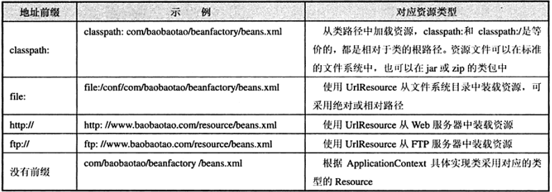
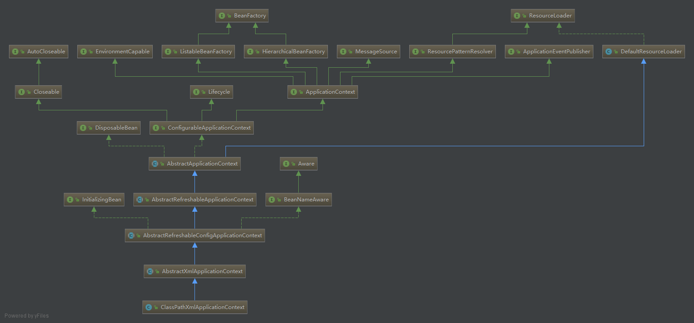
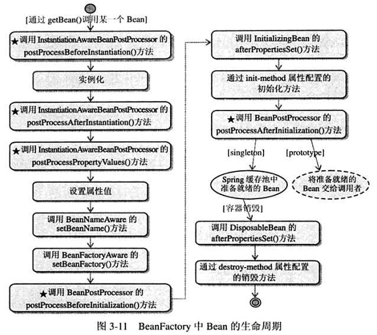
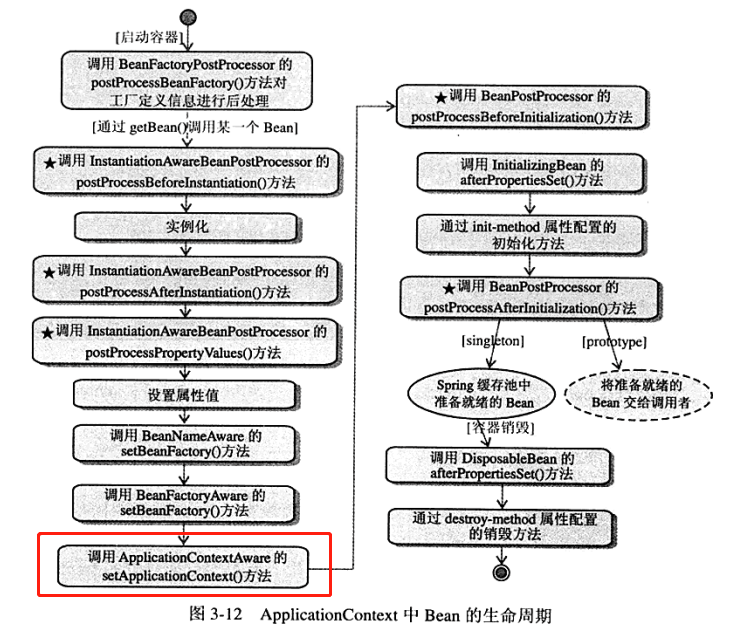
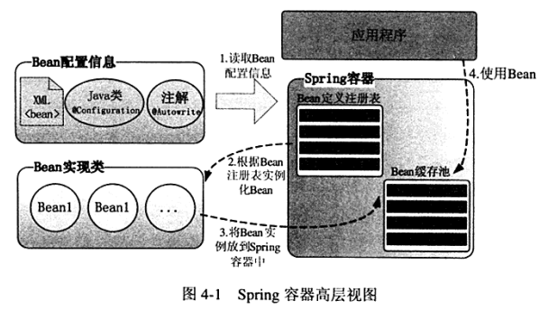
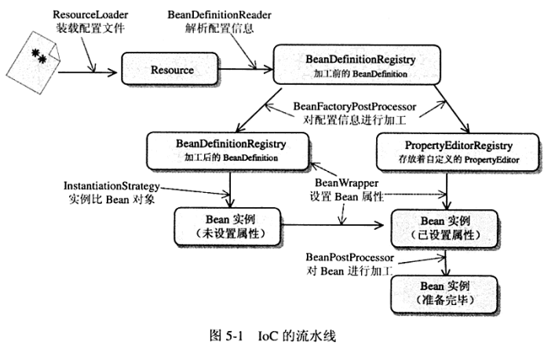

### IoC的概念和DI的概念
IoC：Inverse of Convert，控制反轉，比較難理解的概念，以後補充
DI：Dependency Injection，依賴注入，讓調用類對某一接口實現的依賴關係由第三方（容器和協作類）注入，以移除調用類對某一接口實現類的依賴。

### IoC的三種類型
- 構造函數注入
- 屬性注入
- 接口注入

#### 構造函數注入
這種利用構造器的初始化，注入接口的實現類。這種方式有點像面向對象的組合使用。
```java
//MoAttack.java
public class MoAttack {

    private GeLi geli;

    //通過構造函數參數注入革離的飾演者
    public MoAttack(GeLi geli) {
        this.geli = geli;
    }

    public void cityGateAsk() {
        geli.responseAsk("墨者革離");
    }
}

//Director.java
//導演安排角色扮演者
public class Director {
    public void direct() {
        //指定角色飾演者
        GeLi geli = new LiuDeHua();

        //將具體飾演者到劇本中
        MoAttack moAttack = new MoAttack(geli);
        moAttack.cityGateAsk();
    }
}
```

#### 屬性注入
通過setter方法，在有需要的時候再注入接口實現類。
```java
//MoAttack.java
public class MoAttack {
    private GeLi geli;

    //屬性注入
    public void setGeLi(GeLi geli) {
        this.geli = geli;
    }

    public void cityGateAsk() {
        geli.responseAsk("墨者革離");
    }
}

//Director.java
public class Director {
    public void direct() {
        Geli geli = new LiuDeHua();

        MoAttack moAttack = new MoAttack();
        moAttack.setGeli(geli);
        moAttack.cityGateAsk();
    }
}
```

>构造器注入和setter方法注入区别：构造器注入不可缺少，否则编译直接出错；setter方法注入，若为空，则会在运行期间出现空指针异常，无法正常运行。
>
>可以通过在xml配置文件中增加*<<context:annotation-config/>>* 给setter注入添加一个require的注解，避免空指针异常。


#### 接口注入

將調用類的所有依賴注入的方法抽取到一個接口，調用類實現該接口進行依賴注入。

實現的效果，其實與屬性注入並無區別，反而顯得比屬性注入稍麻煩。
```java
//interface
public interface ActorArrangeable {
    void injectGeLi(GeLi geli);
}

//MoAttack.java
public class MoAttack implements ActorArrangeable {
    private GeLi geli;

    public void injectGeLi(Geli geli) {
        this.geli = geli;
    }

    public void cityGateAsk() {
        geli.responseAsk("墨者革離");
    }
}

//Director.java
public class Director {
    public void direct() {
        MoAttack moAttack = new MoAttack();
        GeLi geli = new LiuDeHua();
        moAttack.injectGeLi(geli);
        moAttack.cityGateAsk();
    }
}
```

### Spring容器完成依賴關係的注入
Spring通過配置文件或註解描述類和類之間的依賴關係，自動完成類的初始化和依賴注入工作，其底層工作原理是java的反射機制。
```xml
<?xml version="1.0" encoding="UTF-8" ?>
<beans xmlns="http://www.springframework.org/schema/beans"
    xmlns:xsi="http://www.w4.org/2001/XMLSchema-instance"
    xmlns:p="http://www.springframework.org/schema/p"
    xsi:schemaLocation="http://www.springframework.org/schema/beans
      http://www.springframeworl.org/schema/beans/spring-beans-4.0.xsd">
    <!-- 實現類的實例化 -->
    <bean id="geli" class="LiuDeHua"/>
    <bean id="moAttack" class="com.smart.ioc.MoAttack"
            p:geli-ref="geli"/><!--通過geli-ref建立依賴關係-->
</beans>
```
最後可以通過new XmlBeanFactory("beans.xml")等方式啓動容器，Spring會根據配置文件的描述信息，自動實例化Bean並完成依賴關係的裝配，從容器中即可返回準備就緒的Bean實例，後續可以直接使用。


### 注解方式注入

@Component注册组建类，spring自动创建对应的bean

@Configuration注册一个配置类，使用@ComponentScan告诉spring容器需要扫描的包并自动装配

@Autowired自动注入

@RunWith(SpringJUnit4ClassRunner.class)便于测试的时候自动创建Spring的上下文

@ContextConfiguration(classes=xxx.class)告诉spring加载什么配置文件


使用Java Config，只需要创建一个配置类，在配置类中编写方法，返回要注入的对象（可以为第三方库的对象），并给方法加上@Bean注解，告诉Spring为返回的对象创建实例。

> 以下图来自bridgeforyou，侵权即删。


### java反射機制
```java
//示例
//Car.java
package com.smart.reflect;

public class Car {
    private String brand;
    private String color;
    private int maxSpeed;

    public Car() {}

    public Car(String brand, String color, int maxSpeed) {
        this.brand = brand;
        this.color = color;
        this.maxSpeed = maxSpeed;
    }

    public void introduce() {
        System.out.println("brand: "+brand+" color: "+color+" maxSpeed: "+maxSpeed);
    }

  	//getter 和 setter方法
  	...
}

//ReflectTest.java
package com.smart.reflect;

import java.lang.reflect.Constructor;
import java.lang.reflect.Method;

public class ReflectTest {
    public static Car initByDefaultConst() throws Throwable {
        //通過類加載器獲取Car類對象
        ClassLoader loader = Thread.currentThread().getContextClassLoader();
        Class clazz = loader.loadClass("com.smart.reflect.Car");

        //獲取類的默認構造器對象並通過它實例化Car
        Constructor cons = clazz.getDeclaredConstructor((Class[])null);
        Car car = (Car)cons.newInstance();

        //通過反射方法設置屬性
        Method setBrand = clazz.getMethod("setBrand", String.class);
        setBrand.invoke(car, "bif");
        Method setColor = clazz.getMethod("setColor", String.class);
        setColor.invoke(car, "black");
        Method setMaxSpeed = clazz.getMethod("setMaxSpeed", int.class);
        setMaxSpeed.invoke(car, 200);

        return car;
    }

    public static void main(String[] args) throws Throwable {
        Car car = initByDefaultConst();
        car.introduce();
    }
}
```
##### ClassLoader
類加載器的作用是尋找類的字節碼，構造出類在jvm中對象的組建。

类装载器把一个类装入JVM中，需要经过以下步骤：

1. 装载：查找和导入Class文件
2. 链接：校验、准备和解析步骤
   - 校验：检查载入Class文件数据的正确性
   - 准备：给类的静态变量分配存储空间
   - 解析：将符号引用转换成直接引用
3. 初始化：对类的静态变量、静态代码块执行初始化工作

JVM运行时会产生3个ClassLoader：*根装载器*, *ExtClassLoader*, *APPClassLoader*。

- 根装载器：采用C++语言编写，在java中不可见，负责装载JRE的核心类库
- ExtClassLoader：为ClassLoader的子类，负责装载JRE扩展目录ext中JAR类包
- AppClassLoader：为ClassLoader的子类，负责装载Classpath路径下的类包

（这三类装载其存在父子层级关系，根装载器为ExtClassLoader的父装载器，ExtClassLoader为APPClassLoader的父装载器）

```java
public class ClassLoaderTest {
    public static void main(String[] args) {
        ClassLoader loader = Thread.currentThread().getContextClassLoader();
        System.out.println("current loader: "+ loader);
        System.out.println("parent loader: "+ loader.getParent());
        System.out.println("grandparent loader: "+loader.getParent().getParent());
    }
}
/*
current loader: sun.misc.Launcher$AppClassLoader@18b4aac2
parent loader: sun.misc.Launcher$ExtClassLoader@677327b6
grandparent loader: null
*/
```

Class类没有public的构造方法，Class对象是在装载类是有JVM通过调用类装载器中的defineClass()方法自动构造。

#### 反射类

- Constructor：类的构造函数反射类，通过Class对象getConstructors()获取所有构造函数反射对象数组，getConstructor(Class... parameterTypes)获取特定参数的构造函数反射对象。构造器对象的newInstance()方法可以创建一个实例对象。
- Method：类方法的反射类，Class对象getDeclaredMethods()获取所有方法反射类对象数组Method[]。再通过invoke方法进行调用。
- Field：类的成员变量的反射类，Class对象getDeclaredFields方法获取类的成员变量反射对象数组。通过Field的set方法对成员变量进行值设置。


### Spring资源访问

#### Resource资源抽象接口

接口主要方法：

- boolean exists()：资源是否存在
- boolean isOpen()：资源是否打开
- URL getURL() throws IOException：返回对应的URL对象
- File getFile() throw IOException：返回对应的File对象
- InputStream getInputStream() throws IOException：返回资源对应的输入流

具体的实现有ByteArrayResource（二进制数组资源），ClassPathResource（类路径下的资源），FileSystemResource（文件系统资源），InputStreamResource（以输入流返回表示资源），ServletContextResource（为访问Web容器上下文中的资源设计的类，以web应用为根目录），UrlResource（疯转Java中URL，可以访问任意资源）

```java
public class ResourceTest {
    public static void main(String[] args) {
        try {
            String filePath = "/home/xxx/chapter/Web/WEB-INF/classes/conf/file1.txt";
            Resource res1 = new FileSystemResource(filePath);
            //以类路径方式加载文件
            Resource res2 = new ClassPathResource("conf/file1.txt");
            
            InputStream ins1 = res1.getInputStream();
            InputStream ins2 = res2.getInputStream();
            
            System.out.println("res1:"+res1.getFilename());
            System.out.println("res2:"+res2.getFilename());
        } catch(IOException e) {
            e.printStackTrace();
        }
    }
}
```

#### 资源地址表达式



> classpath:与classpath*: 的区别：前者只会在第一个加载的包下去查找，而后者会扫描所有这些JAR包和类路径下出现的包名。


#### 资源加载器（ResourceLoader）

ResourceLoader接口定义了一个getResource(String location)方法，ResourcePatternResolver实现ResourceLoader接口，并且定义一个新的方法getResources()方法。Spring则提供了一个标准实现类**PathMatchingResourcePatternResolver**

```java
ResourcePatternResolver resolver = new PathMatchResourcePatternResolver();
//加载所有类包com.baobaotao（及子包）下的以xml为后缀的资源
Resource[] resources = resolver.getResources("classpath*:com/baobaotao/**/*.xml");
for(Resource resource: resources) {
    System.out.println(resource.getDescription());
}
```


### BeanFactory和ApplicationContext

BeanFactory是Spring最核心的接口，提供高级IoC配置机制，实现不同类型的Java对象，底层是基于Java的反射机制实现；ApplicationContext则是基于BeanFactory上建立的，便于创建应用，面向开发者。



除了常见ClassPathXmlApplicationContext加载xml的配置文件之外，spring还提供一种java config的配置方式，使用注解和类编写方式，可以让开发者更好的控制。

```java
@Configuration//表示一个配置信息提供类
public class Beans {
    @Bean//定义一个Bean
    public Car buildCar() {
        Car car = new Car();
        car.setBrand("CA72");
        car.setMaxSpeed(200);
        return car;
    }
}
```

启动Configuration注解的配置类

```java
public class AnnotationApplicationContext {
    public static void main(String[] args) {
        //加载带有Configuration的POJO装载Bean的配置
        ApplicationContext ctx = new AnnotationConfigApplicationContext(Beans.class);
    	Car car = ctx.getBean("car", Car.class);
    }
}
```

也可以通过web.xml方式来启动@Configuration配置类

```xml
<!--指定context参数-->
<context-param>
	<param-name>contextClass</param-name>
    <param-value>org.springframework.web.context.support.AnnotationConfigWebApplicationContext</param-value>
</context-param>
<!--指定标注@Configuration的配置类-->
<context-param>
	<param-name>contextConfigLocation</param-name>
    <param-value>com.baobaotao.AppConfig1,com.baobaotao.AppConfig2</param-value>
</context-param>
<!--ContextLoaderListener将根据上面配置启动Spring容器-->
<listener>
	<listener-class>
    	org.springframeworkwork.web.context.ContextLoaderListener
    </listener-class>
</listener>
```


#### Bean的生命周期






#### spring容器，Bean配置信息，Bean实现类及应用程序的关系



### Spring的技术内幕

spring的AbstractApplicationContext为ApplicationContext的抽象类，该抽象类的refresh()方法定义容器在加载配置文件后各种处理过程。

```java
//refresh方法内部：
//1.初始化Bean Factory
ConfigurableListableBean beanFactory = getBeanFactory();
...
//2.调用工厂后处理器
invokeBeanFactoryPostProcessors();
//3.注册bean后处理器
registerBeanPostProcessor();
//4.初始化消息源
initMessageSource();
//5.初始化应用上下文事件广播器
initApplicationEventMulticaster();
//6.初始化其他特殊的Bean：交给具体子类实现
onRefresh();
//7.注册事件监视器
registerListeners();
//8.初始化所有单实例的Bean，将其放到缓存中，使用懒初始化模式的Bean例外
finishBeanFactoryInitialization(beanFactory);
//9.完成刷新并发布容器刷新时间
finishRefresh();
```

