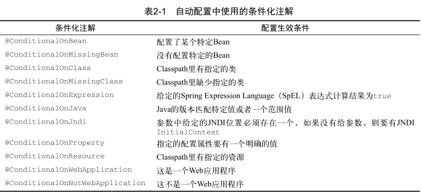

# SpringBoot实战笔记

@SpringBootApplication：将Spring的三个注解组合在一起

- @Configuration：标注该类使用Spring基于Java的配置
- @Component：启用组件扫描，自动将程序中组件类注册为Spring上下文中Bean
- @EnableAutoConfiguration：开启SpringBoot自动配置，无需手动写配置文件


## 自动配置

SpringBoot通过条件化配置特性达到自动配置，主要与@Condition接口相关，用户可以通过实现Condition接口实现自己的接口。

```java
public class JdbcTemplateCondition implements Condition {
    @Override
    public boolean matches(ConditionContext context,
                           AnnotatiedTypeMetadata metadata) {
        try	{
            context.getClassLoader().loadClass("org.springframe.jdbc.core.JdbcTemplate");//判断classpath中是否存在JdbcTemplate类是否存在
            return true;
        } catch(Exception e) {
            return false;
        }
    }
}

//使用
@Conditional(JdbcTemplateCondition.class)//当该类存在才会创建MyService这个Bean
public MuService myService() {
    ...
}
```

SpringBoot中提供的条件化注解



