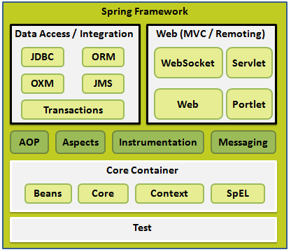
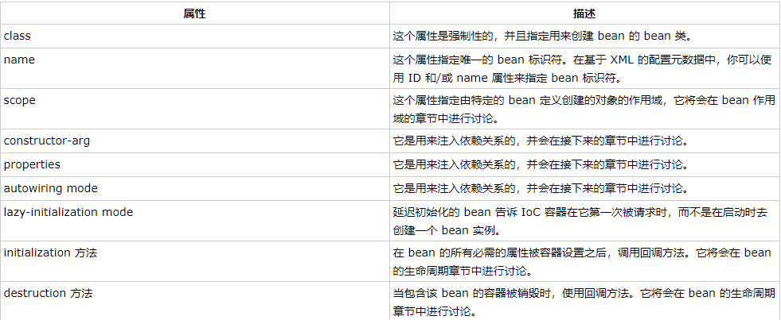
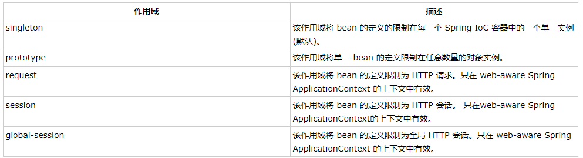

@Component:标注一个普通的Spring Bean类

@Respository：标注一个DAO的组件类

@Service：标注一个业务逻辑组件类

@Controller：标注一个控制器组件类

@Autowired：可用于为类的属性、构造器、方法进行注值


Spring技术：

依赖注入（DI）：控制反转（IOC）的一种具体实现

​	注入方式有：通过构造函数传递参数的方式，通过使用setter方法的等等

面向切面的编程（AOP）：一个程序中跨越多个点的功能称为**横切关注点** ，独立于业务逻辑，如日志记录、声明性事物、安全性以及缓存等等。

AOP将横切关注点从他们所影响的对象中分离出来，DI则将应用程序彼此分离出来。



Spring Hello World实例：

首先定义一个HelloWorld类，有message属性以及相关的setter和getter方法，然后在MainApp文件中使用ClassPathXmlApplicationContext(“xxx.xml”)创建应用程序的上下文，创建初始化beans的配置文件所有的对象，之后可以通过getBean方法获取所需要的bean，根据bean的ID获取对象。在xml配置文件创建自己需要的实例化对象，从而不需要修改HelloWorld.java和MainApp.java文件。


Spring的BeanFactory容器：常用在移动设备和applet的应用中

最常用的XmlBeanFactory，通过xml加载初始化bean


Spring的ApplicationContext容器：

​	常用的：

​	FileSystemXmlApplicationContext：需要提供xml文件的绝对路径，该容器会从xml中加载已被定义的bean，

​	ClassPathXmlApplicationContext：在CLASSPATH环境变量中搜索XML配置文件，该容器就会从xml中加载配置文件，

​	WebXmlApplicationContext：在web应用程序的范围内加载xml配置文件


Bean：

​	bean是一个被实例化，组装，并且被Spring IOC容器所管理的对象。bean是由容器通过配置元数据创建的。

配置元数据对应bean定义的属性：



Spring配置元数据：

XML方式：

```xml
<?xml version="1.0" encoding="UTF-8"?>

<beans xmlns="http://www.springframework.org/schema/beans"
    xmlns:xsi="http://www.w3.org/2001/XMLSchema-instance"
    xsi:schemaLocation="http://www.springframework.org/schema/beans
    http://www.springframework.org/schema/beans/spring-beans-3.0.xsd">

   <bean id="helloWorld" class="com.tutorialspoint.HelloWorld" lazy-init="true" lazy-method="..." destroy-method="...">
       <property name="message" value="Hello World!"/>
   </bean>

</beans>
```

基于注解的配置方式：

基于Java的配置方式：


Bean的scope属性：



```xml
<bean id="helloWorld" scope="singleton">
       <property name="message" value="Hello World!"/>
 </bean>
```


Bean的生命周期：

​	初始化回调：类可以通过实现*org.springframework.beans.factory.InitializingBean* 的void afterPropertiesSet()，也可以通过XML的配置元数据中init-method指定一个void无参方法。

```jav
public class ExampleBean implements InitializingBean {
   @Overwrite	
   public void afterPropertiesSet() {
      // do some initialization work
   }
}
```

```
<bean id="exampleBean" 
         class="examples.ExampleBean" init-method="init"/>
         
//在类中定义一下方法
public class ExampleBean {
    public void init() {}
}
```


​	销毁回调：通过可以通过实现*org.springframework.beans.factory.DisposableBean*的destory方法，亦或者在xml中配置destory-method属性

```
public class ExampleBean implements DisposableBean {
   @Overwrite
   public void destroy() {
      // do some destruction work
   }
}
```

```
<bean id="exampleBean"
         class="examples.ExampleBean" destroy-method="destroy"/>
         
public class ExampleBean {
   public void destroy() {
      // do some destruction work
   }
}
```

Spring的BeanPostProcessor:Bean的后置处理器

​	BeanPostProcessor接口定义了回调方法，可以通过这些方法实现自己的实例化逻辑，依赖解析等等，也可以对bean对象实例进行操作。

```java
/*HelloWorld.java*/
public class HelloWorld {
   private String message;
   public void setMessage(String message){
      this.message  = message;
   }
   public void getMessage(){
      System.out.println("Your Message : " + message);
   }
   public void init(){
      System.out.println("Bean is going through init.");
   }
   public void destroy(){
      System.out.println("Bean will destroy now.");
   }
}
/*InitHelloWorld.java*/
import org.springframework.beans.factory.config.BeanPostProcessor;
import org.springframework.beans.BeansException;
public class InitHelloWorld implements BeanPostProcessor {
   public Object postProcessBeforeInitialization(Object bean, String beanName) throws BeansException {
      System.out.println("BeforeInitialization : " + beanName);
      return bean;  // you can return any other object as well
   }
   public Object postProcessAfterInitialization(Object bean, String beanName) throws BeansException {
      System.out.println("AfterInitialization : " + beanName);
      return bean;  // you can return any other object as well
   }
}
/*MainApp.java*/
import org.springframework.context.support.AbstractApplicationContext;
import org.springframework.context.support.ClassPathXmlApplicationContext;
public class MainApp {
   public static void main(String[] args) {
      AbstractApplicationContext context = new ClassPathXmlApplicationContext("Beans.xml");
      HelloWorld obj = (HelloWorld) context.getBean("helloWorld");
      obj.getMessage();
      context.registerShutdownHook();//关闭hook，确保bean被销毁
   }
}

/*Beans.xml*/
<?xml version="1.0" encoding="UTF-8"?>

<beans xmlns="http://www.springframework.org/schema/beans"
    xmlns:xsi="http://www.w3.org/2001/XMLSchema-instance"
    xsi:schemaLocation="http://www.springframework.org/schema/beans
    http://www.springframework.org/schema/beans/spring-beans-3.0.xsd">

   <bean id="helloWorld" class="com.tutorialspoint.HelloWorld"
       init-method="init" destroy-method="destroy">
       <property name="message" value="Hello World!"/>
   </bean>

   <bean class="com.tutorialspoint.InitHelloWorld" order="..可以用来定义执行前后的顺序..."/>

</beans>
```


