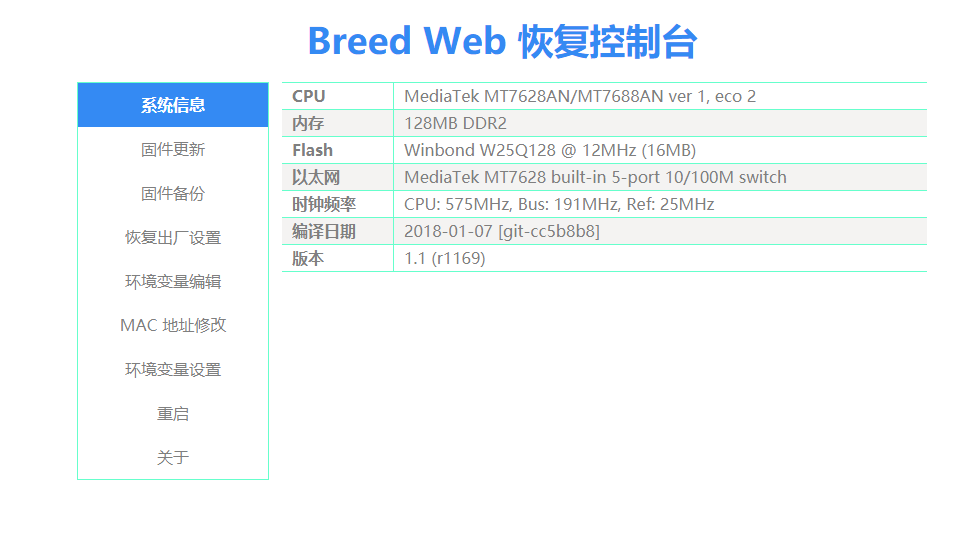
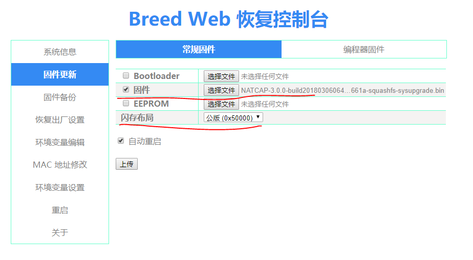
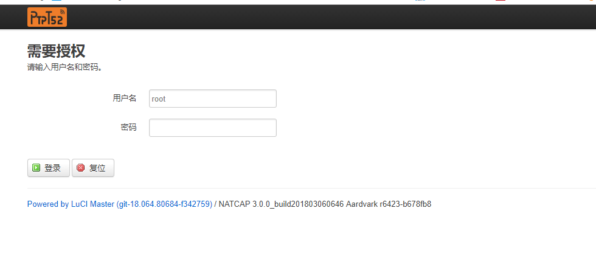
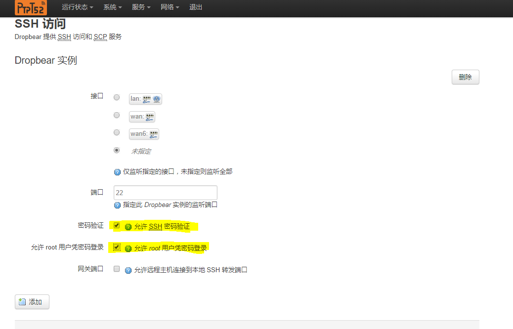
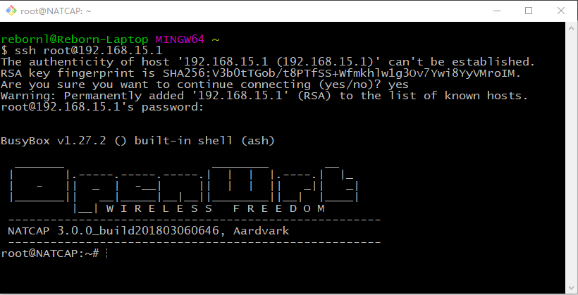
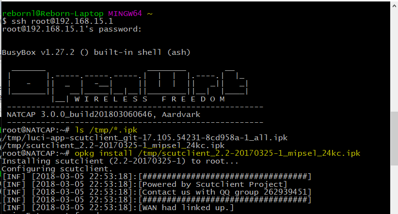
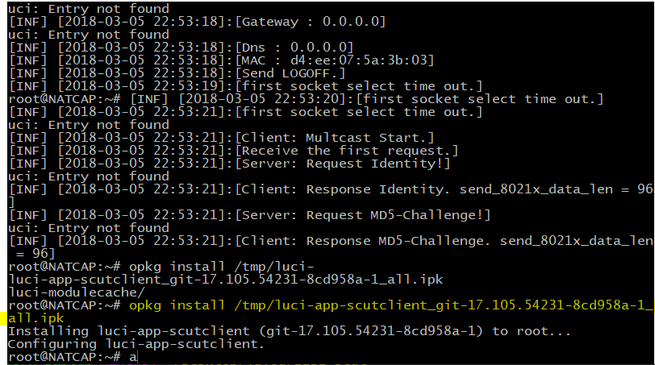
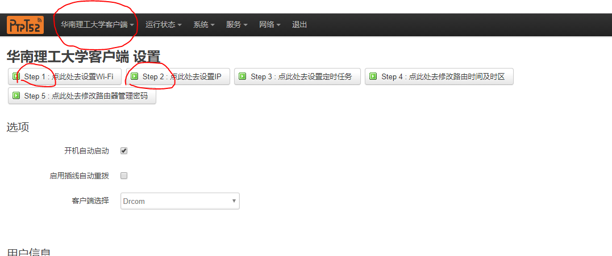

# 极1S刷LEDE

------

Author: Reborn

Update-Date: 2018-03-10

-----


[TOC]

## 前言

最近宿舍用的路由器----极路由1S（新版的，HC5661A），用路由器群提供的hiwifi的旧版wifi破解教程，虽然能用，但是很不稳定，有时候会自动下线，于是就决定把它刷成LEDE，而且可玩性更高，便于使用群里最新提供的scutclient来破解wifi。但是没想到这个HC5661A型号能用最新固件很少，跟HC5661的区别很大。在这里推荐要给路由器刷机的人，买HC5661，固件更多。本来还打算按照LEDE官网提供的教程自己编译一个HC5661A的LEDE最新固件，想到有民间大神[ptpt52](http://www.right.com.cn/forum/space-uid-372524.html)给这台HC5661A编译了一个他自己定制的[LEDE固件](http://www.right.com.cn/forum/forum.php?mod=viewthread&tid=212965&extra=page%3D1&page=1)，还挺好用的，推荐小白使用。

【更新】部分指令修改，增加padavan固件

## 刷机

给路由器刷机，首先刷一个“不死u-boot”，这里有u-boot，breed等等，推荐breed，挺好用的，大神[hackpascal](http://www.right.com.cn/forum/space-uid-200302.html) 还开发了BreedEnter，避免重复按复位键进入breed的web界面。

### 刷Breed

- 先阅读一下[Breed介绍页面](http://www.right.com.cn/forum/thread-161906-1-1.html) 了解一下breed该怎么使用及注意事项，hackpascal大神说的挺详细的
- 其次在https://breed.hackpascal.net/ ，下载适合自己的路由器的Breed固件，我的为[breed-mt7628-hiwifi-hc5661a.bin](https://breed.hackpascal.net/breed-mt7628-hiwifi-hc5661a.bin) 
- 登录极路由后台（当然这里已经默认你已经安装了开发者模式插件，获取了root），windows平台使用putty等工具，Linux下使用ssh登录

```shell
ssh root@极路由管理ip地址 -p 1022
```

- 在Linux下再开一个终端，windows可以使用winscp工具，原理都是一样使用scp指令，将下载的breed关键上传到路由器上的/tmp

```shell
scp -P 1022 /path/breed-mt7628-hiwifi-hc5661a.bin root@极路由管理ip地址:/tmp
```

- 紧接着，在打开的路由器终端上操作，按照hackpascal大神所说mtd指令最好不要加上-r，但是不知道为什么网上很多教程都是加上了-r？？？

```shell
mtd write /tmp/breed-mt7628-hiwifi-hc5661a.bin u-boot
"以下这个加-r不推荐，尽量使用上面的"
mtd -r write /tmp/breed-mt7628-hiwifi-hc5661a.bin u-boot
```

- 最后写入成功会显示reboot，等个几分钟，然后按照[Breed介绍页面](http://www.right.com.cn/forum/thread-161906-1-1.html) 中使用breedenter进入breed界面

  


### 刷Padavan固件（集成scutclient）

不知道是学校网络不稳定，还是固件文件，决定给路由器刷padavan，听说这个固件工作非常稳定，另外我想自己尝试编译一个路由器固件，历经两天，这个很感谢[libgcc](https://www.jianshu.com/u/70c0d31e3717)的耐心解答，终于成功编译出padavan（集成scutclient）For HC5661A的固件。刷机如下的LEDE刷机，刷完之后的配置，请参考libgcc的[简书文件](https://www.jianshu.com/p/cb51fb0fb2ac)。（连续两天都没掉线，或者出现wifi突然没了的情况，确实挺稳定的）


分享我编译出的极1S（HC5661A）的padavan固件：链接: https://pan.baidu.com/s/10F9b6szkhENga6gj8ZUZ5A 密码: pq7y


**固件后台登录的默认域名：my.router；默认ip：192.168.2.1登录用户名/密码 = admin/admin**


### 刷LEDE固件

这里使用的LEDE固件为ptpt52编译的[natcap-3.0.0-build201803060646-ramips-mt76x8-hc5661a-squashfs-sysupgrade.bin](https://router-sh.ptpt52.com/rom/natcap-3.0.0-build201803060646-ramips-mt76x8-hc5661a-squashfs-sysupgrade.bin) 。

- 首先，点击breed的web界面上的固件备份，把EEROM和编程器固件都备份一下，防止刷机失败，还原方式先恢复EEROM，再恢复编程器固件即可。

- 然后点击固件更新，在固件一行点击选择natcap-3.0.0-build201803060646-ramips-mt76x8-hc5661a-squashfs-sysupgrade.bin，闪存布局一般保持默认，若担心，最好上网查询一下自己路由器的闪存布局，极1s保存默认的公版0x500000即可，然后点击**上传**即可。

  

  

  

- 等待更新结束，重启路由器后，ptpt52编译的LEDE登录网址为192.168.15.1，帐号root，密码admin

- 进入LEDE的luci界面，这个时候还需要开启ssh的root登录，在系统选项下开启，不会操作的，可以下载ptpt52提供的[设置包](http://www.right.com.cn/forum/thread-213900-1-1.html) ,进入路由器管理界面，选择 上传备份 恢复配置，重启 即可。

- 

### 安装scutclient

首先从路由器群下载LEDE专用的scutclient压缩包，主要为luci-app-scutclient_git-17.105.54231-8cd958a-1_all.ipk（提供一个gui的设置界面）和scutclient_2.2-20170325-1_mipsel_24kc.ipk（scut上网客户端），将这两个ipk安装包上传到路由器的/tmp目录下，操作方法同上。

```shell
"提供在linux上的全部操作"
"1.上传到路由器上"
scp luci-app-scutclient_git-17.105.54231-8cd958a-1_all.ipk root@192.168.15.1:/tmp
scp scutclient_2.2-20170325-1_mipsel_24kc.ipk root@192.168.15.1:/tmp

"2.路由器终端上的操作"
opkg install /tmp/luci-app-scutclient_git-17.105.54231-8cd958a-1_all.ipk
opkg install /tmp/scutclient_2.2-20170325-1_mipsel_24kc.ipk
```



安装完成后，刷新luci界面，这时候就会出现*华南理工大学客户端*设置的选项，这时候按照选项step1，step2设置完成即可上网。具体步骤详看**华工路由器新手教程V12**中的基础设置6。提供的[百度云链接](https://pan.baidu.com/s/1ahoD631-pB8DrlRVoqwEwg) ，密码rqpi。



### ipv6设置

留坑，暂未设置成功，成功再回来补坑。


> ~~另外文中的图，日后再补！！！~~
