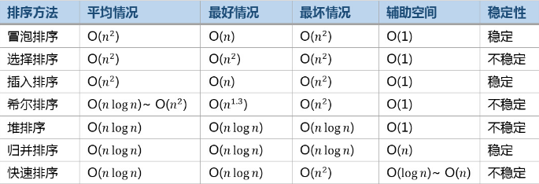

# 经典排序算法

## 前话
最近在做面试题和去面试的时候，都有被问到排序算法的内容。因此，特意记录一下。



## 冒泡排序
原理：重复的走过需要排序的序列，然后一次比较两个元素，按照大小交换他们的位置，直到排序完成
```javascript
//JavaScript版实现
function bubbleSort(arr) {
    var len = arr.length;
    for(var i = 0; i<len; i++) {
        for(var j=1; j<len-i; j++) {
            if(arr[j-1] > arr[j]) {
                temp = arr[j-1];
                arr[j-1] = arr[j];
                arr[j] = temp;
            }   
        }
    }
    return arr;
}

//优化方案：1.当一次遍历完毕，没有发生交换表示排序完成
function bubbleSort2(arr) {
    var len = arr.length;
    for(var i = 0; i<len; i++) {
        var flag = 1;
        for(var j=1; j<len-i; j++) {
            if(arr[j-1] > arr[j]) {
                var temp = arr[j-1];
                arr[j-1] = arr[j];
                arr[j] = temp;
                flag = 0;
            }   
        }
        if(flag) {
            return arr;
        }
    }
}
//优化方案2：每遍历完一次，记录最后一次交换位置的记录
function bubbleSort2(arr) {
    var len = arr.length;
    var k = len;
    for(var i=0; i<len; i++) {
        var flag = 1;
        var nextLen = k;
        for(var j=1; j<nextLen; j++) {
            if(arr[j-1] > arr[j]) {
                var temp = arr[j-1];
                arr[j-1] = arr[j];
                arr[j] = temp;
                k = j;
            }
        }
        if(flag) {
            return arr;
        }
    }
    return arr;
}
```

## 直接选择排序
原理：从序列中选择最小出来，放在序列的头部，然后重新查找次小的放入排好序的默认
```javascript
function selectSort(arr) {
    var len = arr.length;
    for(var i=0; i<len-1; i++) {
        var min = i;
        var flag = 0;
        for(var j=i+1; j<len; j++) {
            if(arr[min] > arr[j]) {
                min = j;
                flag = 1
            }
        }
        if(flag) {
            //有发生交换
            var temp = arr[i];
            arr[i] = arr[min];
            arr[min] = temp;
        }
    }
    return arr;
}

```

## 插入排序算法
原理：从一个元素开始认为是排好的序列，遍历以后的元素将其插入已排好序中合适的位置。
```javascript
function insertionSort(arr) {
    len = arr.length;
    for(var i=1; i<len; i++) {
        if(arr[i-1]>arr[i]) {
            var temp = arr[i];
            var index = i;//要交换的角标
            for(var j=i-1; j>=0; j--) {
                if(arr[j]>temp) {
                    arr[j+1] = arr[j];//往后移动
                    index = j;//记录新的空位
                }
            }

            arr[index] = temp;   
        }
    }
    return arr;
}
```

## 待续...