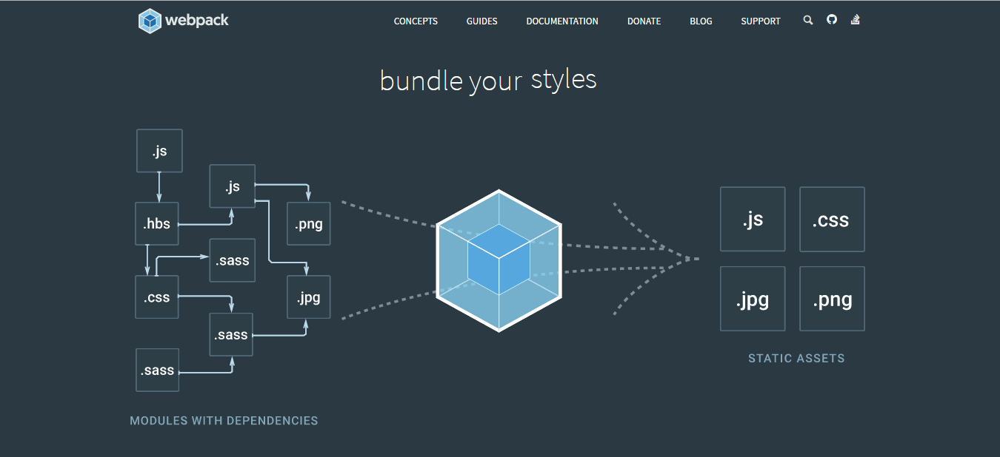

[toc]
## webpack介绍
[webpack](https://webpack.js.org/)是最近很流行的一种前端打包神器，除了能够打包js文件之后，通过引入各种loader，可以打包css，jsx等等，让所有资源变成模块使用。


## webpack使用

### 1.entry属性
该属性是需要打包的文件的入口

使用方法：
```
entry: {[entryChunkName: string]: string|Array<string>}
```
```javascript
//当只有一个页面的时候
entry: "./index.js"
//当有多个入口文件的时候
entry: {
    //当需要分别打包多个文件的时候，可以这样去写 name: "../xx.js"
    page1: ./page1/page1.js,
    page2: ./page2/page2.js
}
```
### 2.output属性
该属性是配置打包文件的输出目录，**path**路径采用的是**绝对路径**

使用方法：（文档中还有其他属性，详见官方文档）
```javascript
//output.filename和output.path是博主现在用到的属性
//当只有一个文件的时候
output: {
    filename: "bundle.js",//文档中推荐打包的文件名为index.js || bundle.js || main.js
    path: __dirname + "/dist",//当前目录中的dist文件夹
}

//当需要分别打包多个文件的时候
output: {
    filename: "[name].js",//还有其他的选项例如[id],[hash]等等
    path: __dirname + "/dist"
}
```

### 3.loaders(加载器)
loader放在module中，这东西是用来加载打包css，png，jsx等其他文件的loader。对于不同loader的使用的方法，需要查看[文档使用](http://www.css88.com/doc/webpack2/loaders/)，注意webpack1和webpack2的使用方法不一样

使用方法：(在配置文件这样写之后，就不需要在命令行中加入参数编译了)
```javascript
//webpack1的写法
module: {
    loaders: [
        {
            test: /\.css/,//这里写的是正则表示，适配该类型的文件
            loader: "style-loader!css-loader"//使用什么加载器进行打包
        }
    ]
}

//webpack2
module: {
    rules: [//使用rules取代原来的loaders
        {
            test: /\.css/,
            use: [//使用use取代
                {loader: "style-loader"},
                {
                    loader: "css-loader",
                    options: {
                        modules: true
                    }
                }
            ]
        }
    ]
}
```

### 4.plugins属性
plugins属性用来实现loader不能实现的功能，具体插件见[官方文档](http://www.css88.com/doc/webpack2/plugins/)

使用方法：
```javascript
plugins: {
    new webpack.BannerPlugin("This is created by Reborn"),//这是使用官方的插件，用于在打包文件顶部中输入信息
}
```